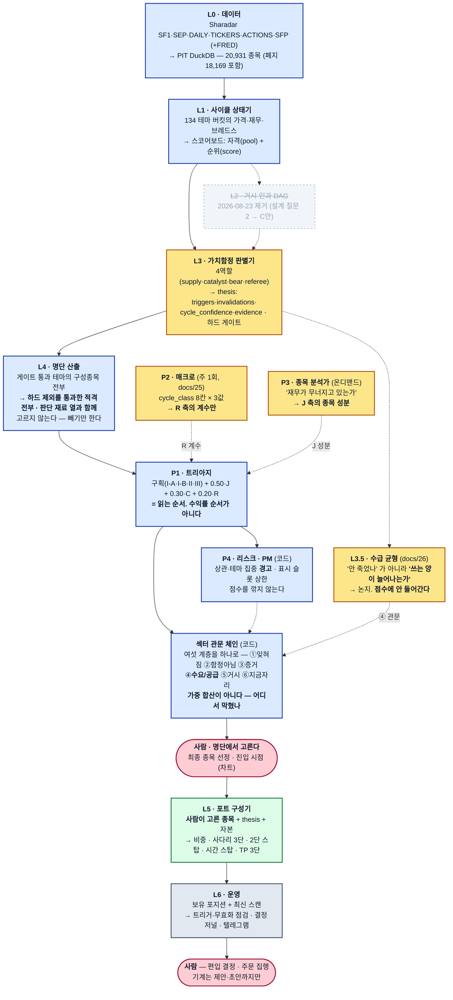

# macro-sector-agent

**아무도 보지 않는 산업 테마를 찾아, 그것이 사이클 저점인지 구조적 사망인지를 가른 뒤, 그 테마 안에서 볼 만한 종목의 명단을 판단 재료와 함께 내놓는 하향식 리서치 파이프라인.**

"지금 무엇을 사야 하는가" 를 먼저 묻지 않는다. **"지금 어느 테마가 잊혀졌는가"** → **"그것이
돌기 시작했는가"** → **"이건 돌아오는 산업인가 죽는 산업인가"** 순으로 묻고, 살아남은 테마
안에서 **하드 제외를 통과한 적격 종목 전부**를 명단으로 내놓는다.

| | 하는 일 |
|---|---|
| **시스템** | 테마를 고른다 → 그 테마 안에서 하드 제외를 통과한 **적격 종목 전부**를 **판단 재료와 함께** 명단으로 내놓는다 |
| **사람** | 명단에서 **최종 종목 선정** · **진입 시점** — 차트를 보고 정한다 |

**산출물은 "고른 종목" 이 아니라 "고를 수 있게 하는 명단" 이다** (2026-08-24 사용자 지시
*"가장 중요한 건 섹터를 잘 골라주는 것"*). 시스템이 종목을 고르지 않는 것은 검정의 귀결이다 —
`docs/15` 에서 어떤 선정 규칙도 "적격 전부 동일가중" 을 이기지 못했고, `docs/17` 에서 어떤 점수
구조도 현행을 이기지 못했다. 전문 `journal/2026-08-24-role-boundary-fixed.md`.

## 시작하기

**요구사항** — Python ≥3.12 · [uv](https://docs.astral.sh/uv/) · `SHARADAR_API_KEY`(L0 데이터
적재에 필수. 스토어가 이미 있으면 스캔·백테스트는 키 없이도 돈다). 선택: `FRED_API_KEY`(L1 축
1 실물 참조 — 없으면 해당 축만 `data_missing` 으로 표시되고 중단하지 않는다), 텔레그램 배달용
`MSA_TELEGRAM_TOKEN`·`MSA_TELEGRAM_CHAT_ID`. **L3 판별기(`msa research`)는 기본
`--provider claude_code` 로 크레딧 0 에 돈다** — 별도 API 키가 필요 없다.

```bash
git clone <이 저장소> && cd macro-sector-agent
make install                 # uv sync
make check                   # ruff + mypy + pytest — 설치 확인
uv run msa run daily         # 첫 실행 — 읽기 전용 후보 뷰. 산출물 state/daily/<date>/
```

`msa run daily` 한 번이 아래 "오늘의 결론" 표와 같은 다이제스트를 만든다. 명령 전체 목록은
[`CLAUDE.md`](CLAUDE.md)와 `msa <명령> --help`, 실전 케이던스와 실패 시 동작은 §5, 첫 운영
순서는 [`docs/18-daily-run.md`](docs/18-daily-run.md)에 있다.

> **읽는 순서.** 처음 보는 사람은 **§2(깔때기)만 읽어도 "20,931 종목이 어떻게 테마당 명단이
> 되는가" 를 끝까지 따라갈 수 있다.** §3 은 각 필터의 정의, §4 는 무엇이 실제로 검정됐는가다.
> **명단에 올랐다는 것이 무엇을 뜻하지 않는지는 §2.2 에 있다** — 한 문장으로: **명단의 테마
> 대부분은 가치함정 판별을 받은 적이 없다.**

<!-- MSA:LATEST -->

## 오늘의 결론 · 2026-09-06

> **차트 확인 대상 29종목 — 편입 가능 `shipping_container` · `cement_aggregates` · `managed_care` · `specialty_chem` 의 명단 63 중**
>
> **`AMRZ` -32% · `CRH` -27% · `CX` -18% · `EXP` -19% · `KNF` -34% · `LOMA` -22% · `MLM` -27% · ⚠`RETO` -98%** 외 21종목. 그중 **레드플래그·감점이 붙은 것 10종목**. 나머지는 52주 고점 −15%(선언값) 이내라 지금 자리가 아니다. **여섯 관문을 다 통과한 섹터는 없다.** 가장 멀리 간 것은 `shipping_container` (④ 수요/공급이 벌어지나 관문에서 막혔다). 가장 많이 막은 곳은 **② 함정이 아닌가** (7개 테마) — 가치 함정 판별을 통과했나 (L3) ⚠ **상위 5 중 4개가 `specialty_chem` 한 테마다 (80%) — 사실상 한 베팅이다.** ⚠ **판정을 만든 근거 97건 중 16건은 원문에서 못 찾은 숫자가 있고 21건은 문서를 읽지 못했다.** 그중 **먼저 열 것 6건** — `cement_aggregates` [24] · [36] / `specialty_chem` [5] · [10] · [31] · [33]. URL 과 무엇을 찾을지는 `msa ops audit-evidence cement_aggregates` · `msa ops audit-evidence specialty_chem` 가 적어 준다. (사람이 원문 대조를 끝낸 5건은 목록에서 뺐다.) 확인된 근거가 하나도 없는 축: capital_cycle, substitution, terminal_risk. **판정은 사람이 차트로 한다** — 시스템이 한 말은 '이 테마는 함정이 아니고 이 종목들은 재무가 버틴다' 까지다. ⚠ 는 레드플래그·감점이 붙은 종목이다.

<sub>`msa run daily` 가 자동으로 다시 쓴다. 스캔 기준일 **2026-09-04** · 가격 스토어 마지막 날 **2026-09-04** (최신 — 미 거래일 기준이다. KST 달력 날짜와 다른 것은 정상이다). 성과 수치는 없다 — 측정값과 판정뿐이다 (`CLAUDE.md` §7).</sub>

| # | 테마 | 점수 | 판별 | 명단 | 플래그 |
|---:|---|---:|---|---:|---|
| 2 | `media_streaming` | 0.83 | 편입 불가 · 0.45 | 36 | SECULAR — 게이트 필요 |
| 3 | `health_it` | 0.81 | 편입 불가 · 0.45 | 41 | SECULAR — 게이트 필요 |
| 4 | `shipping_container` | 0.77 | **편입 가능** · 0.75 | 6 | — |
| 5 | `life_science_tools` | 0.76 | 편입 불가 · 0.45 | 32 | — |
| 6 | `it_services` | 0.74 | 편입 불가 · 0.45 | 56 | SECULAR — 게이트 필요 |
| 7 | `staffing_consulting` | 0.67 | 편입 불가 · 0.35 | 44 | — |
| 8 | `fertilizer_potash` | 0.66 | 편입 불가 · 0.45 | 10 | — |
| 9 | `lumber_paper` | 0.64 | 편입 불가 · 0.35 | 8 | — |

**눌린 종목** (순서 = triage(읽는 순서) — 수익률 순서가 아니다)

**52주 고점 대비**

```
FSI       -47%  ███████████▌
ALHC      -45%  ███████████▏
CNEY      -80%  ███████████████████▊
ALTO      -33%  ████████▏
BGLC      -76%  ██████████████████▊
LWLG      -71%  █████████████████▍
HWKN      -29%  ███████▎
CLOV      -21%  █████▍
ESI       -26%  ██████▋
YMAT      -82%  ████████████████████▎
WDFC      -21%  █████▎
ODC       -17%  ████▎
PRM       -16%  ████
NTIC      -19%  ████▊
MOH       -17%  ████▍
RETO      -98%  ████████████████████████
TGLS      -44%  ██████████▉
SMID      -40%  █████████▉
KNF       -34%  ████████▌
AMRZ      -32%  ████████
CRH       -27%  ██████▊
MLM       -27%  ██████▊
RMIX      -33%  ████████▏
VMC       -20%  █████
USLM      -16%  ████
EXP       -19%  ████▉
LOMA      -22%  █████▍
TTAM      -20%  █████
CX        -18%  ████▋
```

<sub>막대는 크기만 — 부호는 숫자가 든다. 순서는 triage 이지 낙폭 순이 아니다.</sub>

| 종목 | 테마 | 52wH | 가격 | ADV20 | 비고 |
|---|---|---:|---:|---:|---|
| ⚠ `FSI` | `specialty_chem` | -47% | $5.76 | $111.5K | interest_coverage_lt1 |
| `ALHC` | `managed_care` | -45% | $13.54 | $57.4M | — |
| ⚠ `CNEY` | `specialty_chem` | -80% | $0.53 | $38.3K | dilution_gt15 |
| `ALTO` | `specialty_chem` | -33% | $4.04 | $7.3M | — |
| ⚠ `BGLC` | `specialty_chem` | -76% | $1.45 | $12.9K | consecutive_operating_loss;zombie_streak |
| ⚠ `LWLG` | `specialty_chem` | -71% | $5.35 | $17.3M | consecutive_operating_loss |
| `HWKN` | `specialty_chem` | -29% | $129 | $18.0M | — |
| ⚠ `CLOV` | `managed_care` | -21% | $4.25 | $15.4M | consecutive_operating_loss |
| `ESI` | `specialty_chem` | -26% | $36.01 | $159.1M | — |
| ⚠ `YMAT` | `specialty_chem` | -82% | $1.69 | $33.0K | full_capital_impairment |
| `WDFC` | `specialty_chem` | -21% | $208 | $19.5M | — |
| `ODC` | `specialty_chem` | -17% | $87.90 | $10.7M | — |
| ⚠ `PRM` | `specialty_chem` | -16% | $31.76 | $32.4M | interest_coverage_lt1 |
| `NTIC` | `specialty_chem` | -19% | $7.99 | $40.2K | — |
| ⚠ `MOH` | `managed_care` | -17% | $201 | $110.1M | interest_coverage_lt1 |
| ⚠ `RETO` | `cement_aggregates` | -98% | $1.06 | $1.8M | dilution_gt15 |
| `TGLS` | `cement_aggregates` | -44% | $40.84 | $8.8M | — |
| `SMID` | `cement_aggregates` | -40% | $26.03 | $407.5K | — |
| `KNF` | `cement_aggregates` | -34% | $61.83 | $51.2M | — |
| `AMRZ` | `cement_aggregates` | -32% | $43.82 | $178.2M | — |
| `CRH` | `cement_aggregates` | -27% | $94.26 | $386.7M | — |
| `MLM` | `cement_aggregates` | -27% | $515 | $300.4M | — |
| ⚠ `RMIX` | `cement_aggregates` | -33% | $16.70 | $6.8M | consecutive_operating_loss |
| `VMC` | `cement_aggregates` | -20% | $263 | $228.7M | — |
| `USLM` | `cement_aggregates` | -16% | $117 | $15.8M | — |
| `EXP` | `cement_aggregates` | -19% | $194 | $66.9M | — |
| `LOMA` | `cement_aggregates` | -22% | $10.27 | $4.0M | — |
| `TTAM` | `cement_aggregates` | -20% | $15.47 | $3.5M | — |
| `CX` | `cement_aggregates` | -18% | $11.03 | $63.3M | — |

<sub>상위 8개만 싣는다. 전문·제외 사유·판단 재료 열은 `state/daily/2026-09-06/digest.md`. **순위가 높다 = 오래 잊혀졌다** 이지 사라는 뜻이 아니다 — 판별(`msa research`)을 거치지 않은 테마는 후보가 아니다.</sub>

<!-- /MSA:LATEST -->
## 1. 큰 그림



| 색 | 뜻 |
|---|---|
| 파랑 | **코드가 판단한다** — 결정론·전수. 같은 입력에 같은 출력, 과거로 소급 검정 가능 |
| 노랑 | **LLM 이 판단한다** — 코드가 물리적으로 할 수 없는 것(물리적 수급·정책·대체 위협)만 |
| 초록 | **최적화** — SOCP. 판단이 아니라 예산 배분 |
| 회색 | 운영 · 제거된 계층 |
| 분홍 | **사람** — 기계의 산출은 언제나 제안·초안에서 끝난다. **L4 와 L5 사이에도 사람이 있다** |

**LLM 은 파이프라인의 좁은 허리(L3)에만 있다** — 위·아래는 결정론이라 싸고 재현 가능하고
유명세 편향이 안 들어온다. 나중에 붙은 P2·P3·L3.5 도 이 규칙을 지킨다: 새 축을 만들지 않고
기존 축에 기여하거나(P2·P3), 점수에 아예 안 들어간다(L3.5).

**끝의 섹터 관문 체인이 여섯 계층을 하나로 꿴다** — 가중 합산하지 않고 **순서 있는 관문**으로
묻어, 산출이 "몇 점인가" 가 아니라 "어디서 막혔나" 다.

**왜 "섹터" 가 아니라 "테마" 인가.** GICS 11섹터로는 같은 칸(Basic Materials) 안에 드라이버가
전혀 다른 종목들이 섞인다(은·PGM·희토류·리튬). 그래서 분석 단위를 **134개 테마 버킷**으로
더 잘게 쪼갰다(`state/themes.yaml`).

---

## 2. 깔때기 — 20,931 종목이 테마당 명단이 되기까지

**이 절이 이 문서의 핵심이다.** 각 단계에서 **몇 개가 어떤 이유로 빠지는지**를 숫자로 적는다.
`CLAUDE.md` §2("조용한 절단 금지")가 이 깔때기의 규약이다 — 제외된 것은 **수와 사유가 반드시
리포트에 남는다.**


**숫자의 출처 — 전부 재현 가능**

| 단계 | 숫자 | 출처 · 재현 |
|---|---|---|
| L0 스토어 | 20,931 · 폐지 18,169 · 1997-12-31~2026-08-14 | `docs/10` §1 |
| 스캔 입력 유니버스 | 19,717 | `state/scans/2026-08-14/meta.json` `membership` — 스토어 전체와 다르다. 스캔은 **오늘의 티커 테이블**을 배정 입력으로 쓴다 |
| 테마 배정 | 134 버킷 · 배정 **17,917** · 미배정 141 · Shell 1,659 | 좌동 |
| 미분류 시총 | **0.000%** (share 1.1e-06) | `meta.json` `unclassified_mcap` · 기준 <5% (`docs/01` §5) |
| L1 자격 | 134 → **70** | `mean(A_pct, B_pct) ≥ 0.5` · `POOL_MIN = 0.5` (`src/msa/l1/scoreboard.py`) |
| L1 순위 | 상위 **8** | `--top-k 8` 기본값 · `docs/05` §5 (비용 통제) |
| L4 (`commodity_chem`) | 35 → 상장 16 → 하드 제외 8 → **적격 8 = 명단 8행** | `msa picks commodity_chem --asof 2026-08-14 --no-write` |
| 명단에서 몇 개를 사는가 | **정해져 있지 않다** | 운용 가능한 K 는 **열린 질문**이고 새 사전 등록이 필요하다 (`docs/06` §6.2) |

**2026-08-14 상위 8** — `retail_department` .83 · `health_it` .81 · `home_improvement` .81 ·
`media_streaming` .80 · `shipping_container` .78 · `offshore_drilling` .78 · `managed_care` .75 ·
`homebuilders` .72.

> **그중 셋이 `secular_*` 이고 `SECULAR — 게이트 필요` 플래그를 달고 있다. 이것이 정상
> 동작이다** — L1 은 "싼 것" 이 아니라 "잊히고 돌기 시작한 것" 을 위로 올리고, **사양
> 산업인지는 L3 의 하드 게이트가 판정한다.** 상단에 있다는 것은 후보라는 뜻이지 통과했다는
> 뜻이 아니다.

### 2.1 명단은 이렇게 생겼다 — 실측 출력

`msa picks commodity_chem --asof 2026-08-14` 리포트 본문. **이 표는 판단 재료이지 선정이
아니다** — 여덟 행 전부가 "하드 제외를 통과했다" 는 한 가지 사실만 공유하며 **행 사이에 서열이
없다** (`ranking.csv` 의 `group` 열이 전 행 `ELIGIBLE`).

```
■ commodity_chem (범용석유화학)
  논지: … (지평 24~60개월 · 확신도 0.7 · 게이트 passed)
  종목    시총      가격     ADV20     ND/EBITDA     런웨이  52wH   52wL    RS   비고
  ACNT   $135.6M   $15.05   $850.1K   -0.1x(시총)   13.4Q   -15%   +29%    54   레드플래그[영업적자연속]
  REX    $1.5B     $44.59   $6.0M     -0.9x         ∞       -13%   +62%    73   Stage2
  MEOH   $4.3B     $56.12   $43.9M    3.0x          ∞       -14%   +69%    74   Stage2/50d↑
  ...
```

열의 정본은 `src/msa/l4/picks.py` 의 `JUDGMENT_COLUMNS`·`TABLE_HEADERS` 이고, `msa picks` 와
`msa run daily` 다이제스트가 **같은 열**을 쓴다. **새로 만든 지표는 하나도 없다.**

| 열 | 무엇을 보라고 있는가 |
|---|---|
| 시총 · 가격 · `ADV20` | **감점에는 쓰이지 않는다**(아래) — 사람이 보라고 싣는다 |
| `ND/EBITDA` | 6× 를 통과했어도 3.0× 와 −0.9× 는 다른 물건이다. `(시총)` 은 그 값이 EBITDA 공간이 아니라 시총 공간에서 계산됐다는 표시 (`docs/06` §2.2) |
| 런웨이 | 4분기 하드 제외를 통과한 뒤 **얼마나 여유가 있는가**. `∞` 는 영업현금흐름 양수 |
| **`52wH`** | **고점 대비.** 1급 열인 이유는 아래 |
| `52wL` · `RS` | 저점 대비 · RS Rating(0~99) — `52wH` 와 같이 읽는다 |
| `비고` | Stage2 · `50d↑` · `VCP*` · 감점 · 레드플래그 · 부분 축 표기 |

**왜 `52wH` 가 1급 열인가.** 테마가 돈다는 것과 그 안의 종목이 이미 돌았다는 것은 다른 말이다
— 진입 시점은 사람이 정하므로 그 차이가 보여야 한다. 실측(`media_streaming`) — **NFLX**
`52wH` **−38%**(아직 안 돌았다) / **ROKU** `52wH` **+0%**(이미 갔다). 둘 다 같은 명단의 같은
자격이고, 어느 쪽이 좋은 진입인지는 시스템이 답하지 않는다.

**`VCP*` 가 붙은 값은 알려진 결함이다** — `vcp_base` 는 −40% 붕괴 뒤에도 `True` 가 나올 수 있다
(현재가 위치를 보는 조건이 없다, `docs/16` #P2). 고칠 임계값이 문서에 없어 **결함을 표시한 채로
싣는다.**

**유동성·저가 감점(`adv_lt_2m`·`price_lt_2`)은 사용자 지시로 꺼져 있다** — 하드 제외 E1~E6 은
그대로다. 꺼진 항목은 점수 분자·분모 어디에도 안 들어가고(없는 것을 통과로 세지 않는다), 그
사실은 모든 리포트·다이제스트에 매번 적힌다.

### 2.2 명단에 올랐다는 것이 뜻하지 않는 것 — **대부분의 테마는 판정받은 적이 없다**

**이것이 이 문서에서 가장 오해하기 쉬운 곳이다.** 가치함정 판별기(§3(b))는 이 저장소의 핵심
IP 이고 하드 게이트를 쥐고 있지만, **134 테마 전부를 판정하는 경로는 설계상 존재하지 않는다** —
L3 는 비용 통제상 상위 K 테마에만 돈다 (`docs/05` §5).

| 명단에 올랐다는 것이 뜻하는 것 | 뜻하지 **않는** 것 |
|---|---|
| 테마가 L1 자격(`mean(A,B) ≥ 0.5`)을 통과했다 | 그 테마가 **함정이 아니라고 판정됐다** |
| 테마가 순위 상위 K 에 들었다 | 5축 중 어느 하나라도 실제로 평가됐다 |
| 종목이 하드 제외(런웨이·레버리지·만기벽)를 통과했다 | 그 종목이 좋다 · 지금이 살 때다 |

> **명단에 올랐다 = "함정이 아니라고 판정됨" 이 아니라 "판정 절차를 거치지 않음" 이다.**

논지가 없는 테마는 명단 머리에 그 사실이 그대로 적힌다 — `논지: 논지 없음 — L3 미실행`
(`src/msa/thesis.py` `NO_THESIS_NOTE`. 빈 줄을 두지 않는다, `CLAUDE.md` §2). **P1 트리아지의
구획이 이 사실을 점수가 아니라 구조로 강제한다** — 판별 전 테마(구획 III)는 순위가 아무리
높아도 판별 통과 테마(구획 I) 위로 올라오지 못한다 (§3(e)).

---

## 3. 필터를 하나씩

**각 필터가 무엇을 걸러내려는 것인지를 먼저 한 문장으로 말한 뒤** 정의를 준다. 판정을 만드는
상수 27개 전부에 근거가 붙어 있고 `src/msa/basis.py` 한 곳에 모여 있다 — 값을 왜 그렇게
정했는지는 `msa ops why` (`docs/24`).

### (a) L1 — 여섯 블록과 S2 집계 (`docs/02`)

| 블록 | 한 줄로 묻는 것 | 대표 지표 |
|---|---|---|
| **A 망각** | 아무도 이걸 안 보는가? | `dd_10y`(10년 고점 대비 낙폭) · `months_since_peak` · `liquidity_decay` |
| **B 베이스** | 떨어지기를 **멈췄는가**? | `vcp_index` · `rv_ratio` · `range_compression` · `decline_angle` · `volume_dryup` |
| **C 턴** | **돌기 시작했는가**? | `mom_13612w`(Keller 가중 모멘텀) · `rs_slope` · **`breadth_lead`**(구성종목이 지수보다 몇 개월 먼저 돌았나) |
| **D 밸류** | 자기 역사와 비교해 싼가? | `ev_ebitda_med` · `pb_med` · `fcf_yield_med` 의 10년 자기이력 백분위 |
| **E 자본사이클** | 공급이 파괴되고 있는가? | `capex_to_da < 1.0` 지속 분기 수 · `asset_growth` 음수 · `exit_count`/`entry_count` |
| **F 펀더멘털** | 실적이 **감속을 멈췄는가**? | `rev_yoy_d2`(매출 증가율의 2계도함수) · `ebitda_margin_pct` |

**C 블록이 이 저장소의 구조적 우위다** — ETF/지수만 보면 지수가 아직 안 움직여도 놓치는
바닥을, Sharadar 로 구성종목 전부를 보면 **`breadth_lead`**(절반이 이미 200일선 위로 돌았는가)
로 먼저 잡아낸다.

```
pool  = mean(A, B) ≥ 0.5   →  자격 ("잊혀졌는가" = 입장권)
score = C · E · F           →  순위 ("지금 돌고 있는가" = 등수)
D 밸류                      →  어느 점수에도 안 들어간다 (프로필 표시용)
```

`pool` 미달 테마는 순위 없이 관찰 목록으로 남는다(버린 것이 아니다). **여섯을 한 줄로 더하지
않는 이유** — 복합 점수는 백테스트에서 A 망각이 C·E 가 번 것을 상쇄해 예측력을 잃었다(S0/S1
FAIL). 지금의 `pool`+`score` 분리(S2)만 사전 등록된 관문을 통과했다(`docs/backtest-l1.md`).

### (b) L3 — 가치함정 판별기 (`docs/04`)

**이 판별기가 없으면 전체 파이프라인이 자본 파괴 기계가 된다.** L1 상단에 오르는 조건(고점 대비
−60%, 거래 위축, 밸류 하위 10%)을 완벽히 만족했던 과거 사례 중 일부는 사이클 저점(은광
2015-16, 우라늄 2020-23)이었고 일부는 구조적 사망(석탄 2012-16, 오프쇼어 드릴링 2015-20)이었다
— **차트로도 밸류에이션으로도 두 그룹은 구분되지 않는다.** 가르는 것은 하나: **공급이 파괴될 때
수요가 남아 있는가.**

| 축 | 걸러내려는 것 | 정의 |
|---|---|---|
| **1 · 물량 추세** | 가격만 싼 것과 **수요 자체가 줄어드는 것**을 가른다 | 매출이 아니라 **실물 소비량**(톤·온스·MWh·배럴)의 10년 CAGR. 외부 실물 시계열 없으면 동일 구성원 매출÷가격지수 폴백 |
| **2 · 자본사이클** | 공급이 실제로 줄고 있는지 | `capex_to_da < 1` 8분기+ · `asset_growth < 0`. 단독으로는 판별 불가 |
| **3 · 대체 위협** | "이번엔 다르다" 가 진짜인지 | 대체 기술의 침투율과 비용 교차점 |
| **4 · 원가곡선** | 반등이 물리적 필연인지 | 현재 가격 < 산업 P90 현금원가 → 셧다운 강제 |
| **5 · 잔존 위험** | 논지가 맞아도 그때까지 살아남는가 | 24개월 만기부채/시총 · 자산 재활용성 · 규제·지리 집중 리스크 |

축 1 은 테마 **합산** 매출로 재면 공급 파괴가 심할수록 자동으로 "사망" 판정이 나는 함정이 있어
**동일 구성원(same-store)** 입력으로 고쳤다. 축 1 을 쓸 수 있는 테마는 134 중 45개뿐이라 나머지
89개는 판별의 중심이 축 3(LLM 판정)으로 넘어가고, 그 사실(`axis1_available = false`)을 리포트에
숨기지 않는다.

축 1·3 이 둘 다 "사망"이면 자동 기각(L1 스코어 무관), 어느 한쪽만 사망이면 `cycle_confidence`
상한 0.35 로 관찰만. `cycle_class == secular_risk` 인 9개 버킷은 게이트를 기본 적용한다 —
사양 낙인이 아니라 입증 책임의 전환이다. `cycle_confidence` 는 base 0.50 에서 축별 가·감점을
더한 **선언된 산술**이고 탐색으로 조정하지 않는다.

**4역할**: `supply_analyst`(물리적 수급) · `catalyst_analyst`(정책·촉매) · **`bear`**(논지 파괴
전담, 스코어를 숨긴 독립 컨텍스트에서 실행) · `referee`(양측 증거를 축별로 대조해 게이트·
`cycle_confidence`·triggers·invalidations 를 낸다). `evidence` 나 `invalidations` 가 비면 저장을
거부한다 — 게이트 기각과 스키마 미달은 다르고, 기각된 thesis 도 감사를 위해 저장한다.

### (b′) L3.5 — 수급 균형 (`docs/26`)

`docs/04` 의 5축은 전부 부정형이라 다 통과해도 시스템이 할 수 있는 말은 "안 죽었다" 뿐이다.
L3.5 는 한 질문을 더 묻는다 — **향후 3~5년, 실물 수요 증가율이 실물 공급 증가율을 앞지르는가**
(가격·수익률 아닌 물량 대 물량). 공급 경직성은 `byproduct`·`lead_time`·`permitting`·`capital`·
`resource_depletion` 5유형 중 하나로 분류하고, 분류 못 하면 그 주장을 싣지 않는다. **트리아지
점수에는 들어가지 않는다** — 명단이 아니라 논지다.

### (c) L4 — 종목 필터는 2단계다 (2026-08-24 이후 **고르지 않는다**)

**1단계 — 하드 제외.** 스코어가 아니다. 아무리 토크가 커도 넘으면 후보에서 사라진다.

| 필터 | 임계 |
|---|---|
| `cash_runway_q` | **< 4분기 하드 제외** |
| `net_debt_ebitda` | > 4× 감점, **> 6× 하드 제외** |
| `maturity_wall_24m` | **> 0.5 하드 제외**(실측은 `debtc`/시총 대용 — SF1 에 24개월 스케줄이 없다) |
| `going_concern` | 하드 제외 대상이나 **미적용**(감사의견이 스토어에 없다) |
| 재무 판정 불가 | 하드 제외(판정 불가를 통과로 두지 않는다) |

대용치가 결측이어도 **제외하지 않고 세어서 보고한다** — 은행·보험·REIT 는 `debtc` 미보고율이
99%+ 라, 선언된 적 없는 대용치의 부재로 자르면 선언되지 않은 강제가 된다.

**2단계 — S(생존)·T(토크)·M(타이밍) 3축은 선정에 안 쓴다.** 사이클 저점 산업에서는 대부분이
적자라 밸류·퀄리티 팩터가 무의미하거나 반대로 움직이고, S 와 T 는 구조적으로 상충한다(안 죽는
대형주는 안 오르고, 오르는 소형주는 파산 위험이 크다). 2026-08-24 사전 등록 검정(`docs/15`)에서
바벨·시총상위·토크상위 어떤 선정 규칙도 "하드 제외 통과 전부 동일가중"을 이기지 못해 **선정
규칙을 버리고 하드 제외만 남겼다.** 3축·`rank_score`·`barbell_obs` 는 관찰 지표로 계속 산출되어
명단에 판단 재료로만 실린다.

### (d) L5 — 사다리와 스탑 (`docs/07` §3~§5)

물타기가 가능하다는 제약이 설계를 지배한다 — 사다리 **50/30/20**(확신도 낮으면 뒤로 미룸), 2·3
단은 가격 하락 **AND** 무효화 0건 **AND** 트리거 충족을 모두 요구한다. ⚠ **물타기는 가격이
아니라 논지 상태에 조건부다** — 무효화 트리거가 뜨면 추가 매수 금지, 청산 검토로 전환한다.

스탑은 셋 — **Tier 1 논지 스탑**(무효화 1건 관측 → 즉시 전량 청산, 가격 무관) · **Tier 2 자본
스탑**(평단 −35% 또는 포지션 손실 총자본 8%) · **시간 스탑**(호라이즌 경과 AND 트리거 0건). 시간
스탑이 가장 자주 무시되고 가장 중요하다 — **가치함정은 급락이 아니라 정체로 자본을 죽인다.**

### (e) P1~P4 — 읽는 순서 계층

명단이 나온 뒤 남는 질문은 하나다 — "다음 10분을 어느 차트에 쓸 것인가." 수익률 예측이 아니라
**사람의 노동 배분**이라 이름이 `rank`·`score`가 아니라 `triage` 다.

**구획이 점수보다 먼저 온다. 구획을 넘나드는 정렬은 하지 않는다.**

| 구획 | 조건 | 뜻 |
|---|---|---|
| **I-A · 지금 볼 자리** | 편입 가능·신뢰 **그리고** 고점 대비 ≤ −15% | 판별 통과 + 눌림. **차트는 여기서 연다** |
| **I-B · 편입 가능·고점권** | 편입 가능·신뢰, 고점 −15% 이내 | 테마는 좋으나 지금 자리가 아니다 |
| **II · 판별 대기** | 판별받았으나 편입 불가 | 결론이 부정이다 |
| **III · 판별 전 참고** | thesis 없음 | 아무것도 모른다 — 순위가 높아도 후보가 아니다 |

III 이 I 위로 올라오는 일은 구조적으로 불가능하다(§2.2 의 위험을 구획으로 강제).

```
triage = 0.50·J(판정 신뢰도) + 0.30·C(재무 명료도) + 0.20·R(열람 시급성)   # 구획 안에서만 비교
```

J 가 가장 크다 — 판별 안 받은 테마를 먼저 여는 것이 가치함정을 사는 경로이기 때문이다. 나머지
세 자리(P2 매크로 · P3 종목 분석가 · P4 리스크)는 새 축을 만들지 않고 R·J 축의 계수나 경고로만
기여한다 — P2·P3 가 J·C·구획을 직접 건드리는 일은 없다.

---

## 4. 무엇이 증명됐고 무엇이 안 됐나

**이 절에는 성과 수치가 없다** (`CLAUDE.md` §7). L1·L4 의 백테스트는 **스코어의
예측력**(rank-IC)을 재는 것이지 전략의 수익률을 재는 것이 아니다 — L5(사이징·사다리·스탑)와
L3(확신도)이 백테스트 불가라 **전략 수익률이라는 물건 자체가 만들어지지 않는다.**

| 계층 | 백테스트 | 판정 (전문은 판정문에) |
|---|---|---|
| **L1 스코어보드** | 가능 | 관문 0(M3.5) **FAIL** → 구조 검정 후 **S2 PASS** (주 창 12M rank-IC **+0.078 [+0.015, +0.145]**) → M3.7 에서 `C` 단독·`C·E` 둘 다 현행을 못 이겨 **S2 유지.** `docs/backtest-l1.md` §12·§14 |
| **L4 종목 선정** | 가능 | Q1(`rank_score`) **+0.0144 [−0.0008, +0.0266] FAIL** · Q2 축 단독은 **T̃ 가 부호 반대** · Q3 하드 필터는 알파가 아니지만 **사망률 차 CI 하한 > 0 — 메커니즘은 확인됐다.** `docs/backtest-l4.md` · `docs/15` §4 |
| L5 사다리·스탑 | **시뮬만** — 경로 의존, 표본 적음 | 참고치이지 관문이 아니다 |
| **L3 · 축 3 대체 위협** | **불가** | 2015년의 정책·광산 폐쇄·재고를 오늘의 지식 없이 재구성할 수 없다 |
| **P1 · L3.5** | **대상이 아니다** | 수익률을 주장하지 않는다 — 읽는 순서(P1)와 논지(L3.5)다 |
| **전체 통합** | **존재하지 않고 앞으로도 불가능** | 위 줄들이 불가인 이상 통합 수익률은 정의되지 않는다 |

> **합격을 읽는 법.** CI 하단이 0 을 겨우 넘는 수준이고 표본이 사실상 하나(1998~2026 미국
> 단일 경로)라, "한 경로에서 어긋나지 않았다" 이지 "맞았다" 가 아니다. 다음 검정에서 틀릴 수
> 있고, 그때 하는 일은 값을 고치는 것이 아니라 **기록하는 것**이다.

**백테스트할 수 없는 절반은 어떻게 하는가.** 관문을 **사전 반증가능성**으로 옮긴다. 모든 논지는
관측 가능한 트리거와 무효화 조건 없이는 저장될 수 없고(스키마가 거부한다), 검증은 전향적
기록(`journal/`, append-only)과 확신도 캘리브레이션(Brier score, `msa ops calibration`)이 한다.
기각 대장은 기각한 테마의 수익률을 분기마다 갱신한다 — **기각이 옳았는지도 검증 대상이다.**

---

## 5. 쓰는 법

설치·첫 실행은 위 **시작하기**를 보라. 여기 적는 것은 **케이던스와 실패 시 동작**뿐이고, 명령
전체 목록은 [`CLAUDE.md`](CLAUDE.md)와 `msa <명령> --help` 다. **이 저장소는 데이터를 적재하지
않는다** — `Store` 는 DuckDB 를 읽기 전용으로 연다.

```bash
uv run msa run weekly        # 주간 점검: 전수 스캔 + msa check --weekly
uv run msa run monthly       # 월간 (의사결정 주기). 끝은 제안·초안, 집행은 사람
```

| | 단계 (코드 정본) | 판별(L3)이 어디서 도는가 |
|---|---|---|
| `msa run daily` | `scan · select · picks · diff · check · digest · research · audit · triage · readme` (`daily.py` `DAILY_STEPS`) | `research` 는 **다이제스트 뒤**에 오고 **편입 가능이 하나 나오면 멈춘다** — 목적이 "최고의 섹터 중 편입 가능한 것" 하나이기 때문이다. 그래서 **다이제스트의 테마 대부분은 여전히 논지가 없다** (§2.2) |
| `msa run monthly` | `scan · select ·` **`research`** `· ingest · picks · assemble · portfolio · report` (`run.py` `MONTHLY_STEPS`) | 판정이 **상위 K=8 테마에** 생긴다. 기본값 `--provider none` 은 호출하지 않고 사람 논지·직전 thesis 를 **찾기만** 한다 |

**결정 케이던스는 월간 그대로다.** 일간은 읽기 전용 후보 뷰이고, 거기서 고르는 것은 사람이다.

**실패 시 동작** — 적재 실패·커버리지 감사 실패(미분류 시총 ≥ 5% 등)는 **스캔 중단**(부분
데이터로 스코어를 내지 않는다) · FRED 결측은 `axis1_status = data_missing` 표시하고 **중단하지
않음** · 스키마 검증 실패는 해당 테마 후보 제외 + 사유 기록 · 최적화 infeasible 은 완화 순서
**고정** C3(집중도) → C1(MDD), **MDD 는 마지막까지 지킨다.** 환경변수는 `SHARADAR_API_KEY`
없으면 L0 적재 불가(스토어가 있으면 스캔·백테스트는 돈다) · `FRED_API_KEY` 없으면 축 1 실물
참조가 `data_missing`(중단하지 않는다) · 텔레그램 토큰·챗ID 가 둘 다 있을 때만 배달한다.

---

## 6. 지배 규약 — 정본은 [`CLAUDE.md`](CLAUDE.md)

**§1 탐색으로 가중치를 정하지 않는다 — 이 프로젝트의 중심.** 이 저장소의 지배적 실패 위험은
오버피팅이다: 표본이 사실상 하나(1998~2026 단일 경로)라 DSR·PBO 같은 관문도 거기 맞춰 옮긴
가중치를 못 잡는다. 그래서 L1·L4·P1 의 가중치는 **선언하고 근거를 적을 뿐, 데이터에 맞춰
조정하지 않는다.** 파라미터 스윕·그리드 서치는 금지된다. 검정이 "이 블록은 일하지 않는다"고
말하면 그 사실을 기록하고 가중치는 그대로 둔다 — 구조를 바꾸는 유일한 경로는 **결과를 보기
전에** 후보와 합격 기준을 문서에 고정하는 사전 등록이다.

**나머지 규약(§2~§8)은 한 줄씩** — 조용한 절단 금지 · 출처 없는 주장은 저장되지 않는다 · 종목은
사람이 고른다(에이전트는 테마만) · 논지는 무효화 조건 없이 저장할 수 없다 · 결정 저널은
append-only · 성과 수치를 광고하지 않는다 · 투자 조언이 아니다. 전문은 `CLAUDE.md`.

---

## 7. 문서 지도

**계층 정의** — [00](docs/00-overview.md) 문제 정의·비목표 · [01](docs/01-theme-universe.md) 134
버킷·`cycle_class` · [02](docs/02-cycle-state.md) L1 6블록 · [04](docs/04-value-trap.md) **판별기
— 핵심 IP** · [05](docs/05-agent-research.md) L3 계약·bear 격리 · [06](docs/06-stock-selection.md)
L4 3축 · [07](docs/07-portfolio.md) L5 · [08](docs/08-data-contract.md) 데이터 계약 ·
[09](docs/09-operations.md) 케이던스·저널·배달 · [10](docs/10-validation.md) **무엇을 재고 무엇을
못 재는가** · [18](docs/18-daily-run.md) **실전 운영** · [24](docs/24-basis-registry.md) **왜 그
값인가**.

**검정 판정문** — [backtest-l1](docs/backtest-l1.md) · [backtest-l4](docs/backtest-l4.md) ·
[16](docs/16-module-audit-2026-08-24.md) 모듈 감사(`vcp_base` 결함 #P2).

**사전 등록된 설계 질문**(12~26)과 **결정 저널**(`journal/`, append-only — 무엇을 언제 왜
정했는지)은 각 디렉터리를 참고.

**관련 저장소** — `portfolio-research`(Sharadar 어댑터·DuckDB PIT 스토어·팩터 DSL) ·
`momentum`(Minervini Stage·VCP·RS Rating) · `fin-checkup`(재무 레드플래그·텔레그램). 의존이 아니라
**복사(vendoring)**다 — 각자 다른 릴리스 주기를 갖는 저장소를 git 의존으로 묶지 않기 위해서다.

## 면책

**투자 조언이 아니다.** 이 저장소는 측정값과 명시된 가정을 산출할 뿐이며 집행은 사람이 한다.
자동 주문 기능은 만들지 않는다. 기대수익률·승률·수익 배수는 이 문서에도 리포트에도 쓰지
않는다 (`CLAUDE.md` §7·§8).
