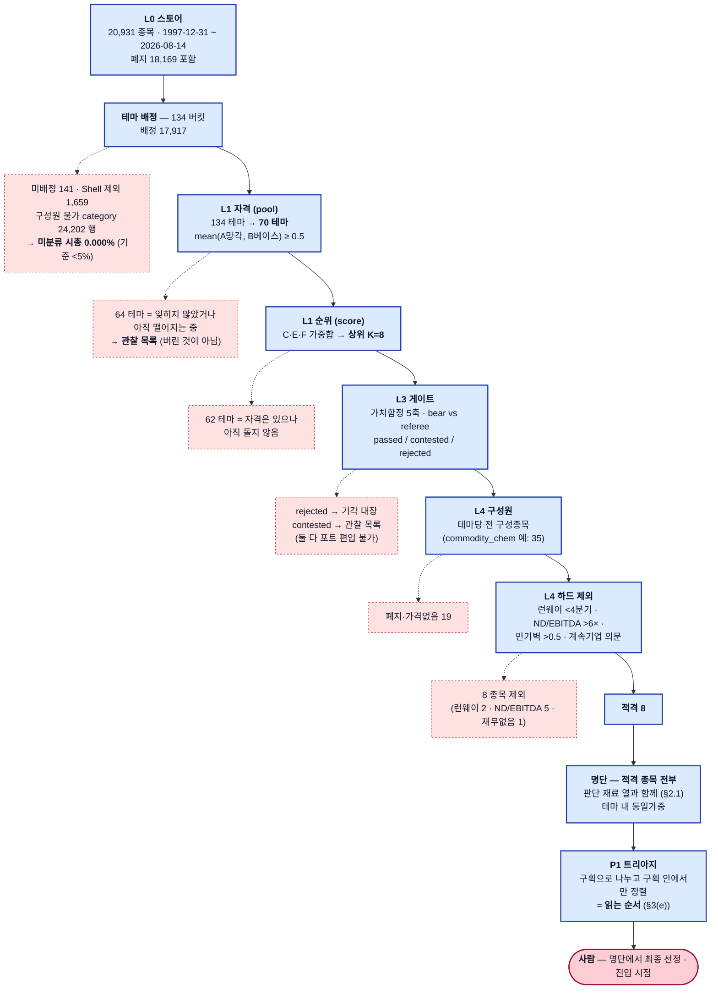

# macro-sector-agent

**아무도 보지 않는 산업 테마를 찾아, 그것이 사이클 저점인지 구조적 사망인지를 가른 뒤, 그 테마 안에서 볼 만한 종목의 명단을 판단 재료와 함께 내놓는 하향식 리서치 파이프라인.**

"지금 무엇을 사야 하는가" 를 먼저 묻지 않는다. **"지금 어느 테마가 잊혀졌는가"** → **"그것이
돌기 시작했는가"** → **"이건 돌아오는 산업인가 죽는 산업인가"** 순으로 묻고, 살아남은 테마
안에서 **하드 제외를 통과한 적격 종목 전부**를 명단으로 내놓는다.

| | 하는 일 |
|---|---|
| **시스템** | 테마를 고른다 → 그 테마 안에서 하드 제외를 통과한 **적격 종목 전부**를 **판단 재료와 함께** 명단으로 내놓는다 |
| **사람** | 명단에서 **최종 종목 선정** · **진입 시점** — 차트를 보고 정한다 |

**산출물은 "고른 종목" 이 아니라 "고를 수 있게 하는 명단" 이다** (2026-08-24 사용자 지시
*"가장 중요한 건 섹터를 잘 골라주는 것"*). 시스템이 종목을 고르지 않는 것은 검정의 귀결이다 —
`docs/15` 에서 어떤 선정 규칙도 "적격 전부 동일가중" 을 이기지 못했고, `docs/17` 에서 어떤 점수
구조도 현행을 이기지 못했다. 전문 `journal/2026-08-24-role-boundary-fixed.md`.

> **읽는 순서.** 처음 보는 사람은 **§2(깔때기)만 읽어도 "20,931 종목이 어떻게 테마당 명단이
> 되는가" 를 끝까지 따라갈 수 있다.** §3 은 각 필터의 정의, §4 는 무엇이 실제로 검정됐는가다.
> **명단에 올랐다는 것이 무엇을 뜻하지 않는지는 §2.2 에 있다** — 한 문장으로: **명단의 테마
> 대부분은 가치함정 판별을 받은 적이 없다.**

<!-- MSA:LATEST -->

## 오늘의 결론 · 2026-09-06

> **차트 확인 대상 30종목 — 편입 가능 `shipping_container` · `cement_aggregates` · `managed_care` · `specialty_chem` 의 명단 63 중**
>
> **`AMRZ` -32% · `CRH` -29% · `CX` -20% · `EXP` -20% · `KNF` -34% · `LOMA` -23% · `MLM` -28% · ⚠`RETO` -98%** 외 22종목. 그중 **레드플래그·감점이 붙은 것 10종목**. 나머지는 52주 고점 −15%(선언값) 이내라 지금 자리가 아니다. **여섯 관문을 다 통과한 섹터는 없다.** 가장 멀리 간 것은 `shipping_container` (④ 수요/공급이 벌어지나 관문에서 막혔다). 가장 많이 막은 곳은 **② 함정이 아닌가** (7개 테마) — 가치 함정 판별을 통과했나 (L3) ⚠ **상위 5 중 4개가 `specialty_chem` 한 테마다 (80%) — 사실상 한 베팅이다.** ⚠ **판정을 만든 근거 97건 중 16건은 원문에서 못 찾은 숫자가 있고 21건은 문서를 읽지 못했다.** 그중 **먼저 열 것 6건** — `cement_aggregates` [24] · [36] / `specialty_chem` [5] · [10] · [31] · [33]. URL 과 무엇을 찾을지는 `msa ops audit-evidence cement_aggregates` · `msa ops audit-evidence specialty_chem` 가 적어 준다. (사람이 원문 대조를 끝낸 5건은 목록에서 뺐다.) 확인된 근거가 하나도 없는 축: capital_cycle, substitution, terminal_risk. **판정은 사람이 차트로 한다** — 시스템이 한 말은 '이 테마는 함정이 아니고 이 종목들은 재무가 버틴다' 까지다. ⚠ 는 레드플래그·감점이 붙은 종목이다.
>
> ⚠ **가격 스토어가 2026-09-03 에서 멈춰 있다 — 마지막 거래일보다 뒤처졌다.** 적재를 확인해라. 52주 고점 대비도 그 날짜 값이다.

<sub>`msa run daily` 가 자동으로 다시 쓴다. 스캔 기준일 **2026-09-03** · 가격 스토어 마지막 날 **2026-09-03** (거래일 1일 뒤처짐 — 미 거래일 기준이다. KST 달력 날짜와 다른 것은 정상이다). 성과 수치는 없다 — 측정값과 판정뿐이다 (`CLAUDE.md` §7).</sub>

| # | 테마 | 점수 | 판별 | 명단 | 플래그 |
|---:|---|---:|---|---:|---|
| 1 | `health_it` | 0.84 | 편입 불가 · 0.45 | 41 | SECULAR — 게이트 필요 |
| 2 | `media_streaming` | 0.81 | 편입 불가 · 0.45 | 36 | SECULAR — 게이트 필요 |
| 4 | `shipping_container` | 0.77 | **편입 가능** · 0.75 | 6 | — |
| 5 | `life_science_tools` | 0.77 | 편입 불가 · 0.45 | 32 | — |
| 6 | `it_services` | 0.74 | 편입 불가 · 0.45 | 56 | SECULAR — 게이트 필요 |
| 7 | `staffing_consulting` | 0.67 | 편입 불가 · 0.35 | 44 | — |
| 8 | `fertilizer_potash` | 0.66 | 편입 불가 · 0.45 | 10 | — |
| 9 | `reit_industrial` | 0.64 | 편입 불가 · 0.5 | 9 | — |

**눌린 종목** (순서 = triage(읽는 순서) — 수익률 순서가 아니다)

**52주 고점 대비**

```
FSI       -47%  ███████████▋
ALHC      -45%  ███████████▏
CNEY      -80%  ███████████████████▋
ALTO      -33%  ████████▏
BGLC      -76%  ██████████████████▋
HWKN      -29%  ███████▎
LWLG      -72%  █████████████████▊
CLOV      -21%  █████▍
ESI       -29%  ███████▏
YMAT      -80%  ███████████████████▉
ODC       -16%  ████
WDFC      -20%  █████
CMT       -15%  ███▊
PRM       -15%  ███▊
NTIC      -19%  ████▋
MOH       -16%  ████▏
TGLS      -46%  ███████████▍
RETO      -98%  ████████████████████████
SMID      -39%  █████████▊
KNF       -34%  ████████▍
AMRZ      -32%  ████████
CRH       -29%  ███████▎
MLM       -28%  ██████▉
RMIX      -35%  ████████▋
USLM      -17%  ████▎
VMC       -21%  █████▏
EXP       -20%  ████▉
LOMA      -23%  █████▋
TTAM      -21%  █████▎
CX        -20%  ████▉
```

<sub>막대는 크기만 — 부호는 숫자가 든다. 순서는 triage 이지 낙폭 순이 아니다.</sub>

| 종목 | 테마 | 52wH | 가격 | ADV20 | 비고 |
|---|---|---:|---:|---:|---|
| ⚠ `FSI` | `specialty_chem` | -47% | $5.72 | $111.7K | interest_coverage_lt1 |
| `ALHC` | `managed_care` | -45% | $13.54 | $57.9M | — |
| ⚠ `CNEY` | `specialty_chem` | -80% | $0.53 | $38.9K | dilution_gt15 |
| `ALTO` | `specialty_chem` | -33% | $4.03 | $7.6M | — |
| ⚠ `BGLC` | `specialty_chem` | -76% | $1.47 | $14.5K | consecutive_operating_loss;zombie_streak |
| `HWKN` | `specialty_chem` | -29% | $129 | $17.9M | — |
| ⚠ `LWLG` | `specialty_chem` | -72% | $5.12 | $17.7M | consecutive_operating_loss |
| ⚠ `CLOV` | `managed_care` | -21% | $4.25 | $16.7M | consecutive_operating_loss |
| `ESI` | `specialty_chem` | -29% | $34.98 | $155.4M | — |
| ⚠ `YMAT` | `specialty_chem` | -80% | $1.82 | $32.4K | full_capital_impairment |
| `ODC` | `specialty_chem` | -16% | $89.14 | $11.4M | — |
| `WDFC` | `specialty_chem` | -20% | $210 | $19.7M | — |
| `CMT` | `specialty_chem` | -15% | $24.04 | $615.9K | — |
| ⚠ `PRM` | `specialty_chem` | -15% | $32.05 | $33.1M | interest_coverage_lt1 |
| `NTIC` | `specialty_chem` | -19% | $8.03 | $39.8K | — |
| ⚠ `MOH` | `managed_care` | -16% | $203 | $111.9M | interest_coverage_lt1 |
| `TGLS` | `cement_aggregates` | -46% | $39.26 | $9.1M | — |
| ⚠ `RETO` | `cement_aggregates` | -98% | $1.06 | $1.8M | dilution_gt15 |
| `SMID` | `cement_aggregates` | -39% | $26.27 | $405.1K | — |
| `KNF` | `cement_aggregates` | -34% | $62.13 | $52.8M | — |
| `AMRZ` | `cement_aggregates` | -32% | $44.01 | $193.0M | — |
| `CRH` | `cement_aggregates` | -29% | $92.04 | $401.7M | — |
| `MLM` | `cement_aggregates` | -28% | $509 | $294.7M | — |
| ⚠ `RMIX` | `cement_aggregates` | -35% | $16.18 | $6.9M | consecutive_operating_loss |
| `USLM` | `cement_aggregates` | -17% | $116 | $16.1M | — |
| `VMC` | `cement_aggregates` | -21% | $260 | $231.4M | — |
| `EXP` | `cement_aggregates` | -20% | $194 | $68.0M | — |
| `LOMA` | `cement_aggregates` | -23% | $10.14 | $4.4M | — |
| `TTAM` | `cement_aggregates` | -21% | $15.21 | $3.5M | — |
| `CX` | `cement_aggregates` | -20% | $10.87 | $66.8M | — |

<sub>상위 8개만 싣는다. 전문·제외 사유·판단 재료 열은 `state/daily/2026-09-06/digest.md`. **순위가 높다 = 오래 잊혀졌다** 이지 사라는 뜻이 아니다 — 판별(`msa research`)을 거치지 않은 테마는 후보가 아니다.</sub>

<!-- /MSA:LATEST -->
## 1. 큰 그림


| 색 | 뜻 |
|---|---|
| 파랑 | **코드가 판단한다** — 결정론·전수. 같은 입력에 같은 출력, 과거로 소급 검정 가능 |
| 노랑 | **LLM 이 판단한다** — 코드가 물리적으로 할 수 없는 것(물리적 수급·정책·대체 위협)만 |
| 초록 | **최적화** — SOCP. 판단이 아니라 예산 배분 |
| 회색 | 운영 · 제거된 계층 |
| 분홍 | **사람** — 기계의 산출은 언제나 제안·초안에서 끝난다. **L4 와 L5 사이에도 사람이 있다** |

**LLM 이 파이프라인의 좁은 허리에만 있는 것이 설계 의도다.** 위(L1)는 전수·결정론이라 싸고
재현 가능하고, 아래(L4·P1)도 결정론이라 유명세 편향이 안 들어온다 (`CLAUDE.md` §4). 나중에
붙은 자리도 그 규칙을 지킨다 — **P2·P3 는 새 축을 만들지 않고 기존 축에 기여하고, L3.5 는
점수에 아예 들어가지 않는다.**

**끝의 관문 체인이 여섯 계층을 하나로 꿴다** (`msa.sector`). 여섯을 가중 합산하지 않는 것이
요점이다 — 합치는 순간 `docs/15` 가 죽인 종합 점수의 재발이고, 그 가중치는 어디서도
검정되지 않는다. 대신 **순서 있는 관문**이고 산출은 "어디서 막혔나" 다. 새 상수를 하나도
만들지 않는다: 여섯 관문의 임계는 전부 다른 모듈이 이미 선언한 것을 import 한다.

**왜 "섹터" 가 아니라 "테마" 인가.** 2026년 원자재 사례 — AG(은)·SBSW(PGM)·MP(희토류)·
ALM(리튬) — 는 GICS 로 보면 **전부 Basic Materials 한 칸**인데 드라이버는 넷 다 다르다.
11섹터 해상도로는 이 트레이드가 보이지 않는다. 그래서 분석 단위가 **134개 테마 버킷**이다
(`docs/01` §3, 정본 `state/themes.yaml`).

---

## 2. 깔때기 — 20,931 종목이 테마당 명단이 되기까지

**이 절이 이 문서의 핵심이다.** 각 단계에서 **몇 개가 어떤 이유로 빠지는지**를 숫자로 적는다.
`CLAUDE.md` §2("조용한 절단 금지")가 이 깔때기의 규약이다 — 제외된 것은 **수와 사유가 반드시
리포트에 남는다.**



**숫자의 출처 — 전부 재현 가능**

| 단계 | 숫자 | 출처 · 재현 |
|---|---|---|
| L0 스토어 | 20,931 · 폐지 18,169 · 1997-12-31~2026-08-14 | `docs/10` §1 |
| 스캔 입력 유니버스 | 19,717 | `state/scans/2026-08-14/meta.json` `membership` — 스토어 전체와 다르다. 스캔은 **오늘의 티커 테이블**을 배정 입력으로 쓴다 |
| 테마 배정 | 134 버킷 · 배정 **17,917** · 미배정 141 · Shell 1,659 | 좌동 |
| 미분류 시총 | **0.000%** (share 1.1e-06) | `meta.json` `unclassified_mcap` · 기준 <5% (`docs/01` §5) |
| L1 자격 | 134 → **70** | `mean(A_pct, B_pct) ≥ 0.5` · `POOL_MIN = 0.5` (`src/msa/l1/scoreboard.py`) |
| L1 순위 | 상위 **8** | `--top-k 8` 기본값 · `docs/05` §5 (비용 통제) |
| L4 (`commodity_chem`) | 35 → 상장 16 → 하드 제외 8 → **적격 8 = 명단 8행** | `msa picks commodity_chem --asof 2026-08-14 --no-write` |
| 명단에서 몇 개를 사는가 | **정해져 있지 않다** | 운용 가능한 K 는 **열린 질문**이고 새 사전 등록이 필요하다 (`docs/06` §6.2) |

**2026-08-14 상위 8** — `retail_department` .83 · `health_it` .81 · `home_improvement` .81 ·
`media_streaming` .80 · `shipping_container` .78 · `offshore_drilling` .78 · `managed_care` .75 ·
`homebuilders` .72.

> **그중 셋이 `secular_*` 이고 `SECULAR — 게이트 필요` 플래그를 달고 있다. 이것이 정상
> 동작이다** — L1 은 "싼 것" 이 아니라 "잊히고 돌기 시작한 것" 을 위로 올리고, **사양
> 산업인지는 L3 의 하드 게이트가 판정한다.** 상단에 있다는 것은 후보라는 뜻이지 통과했다는
> 뜻이 아니다.

### 2.1 명단은 이렇게 생겼다 — 실측 출력

`msa picks commodity_chem --asof 2026-08-14` 리포트 본문. **이 표는 판단 재료이지 선정이
아니다** — 여덟 행 전부가 "하드 제외를 통과했다" 는 한 가지 사실만 공유하며 **행 사이에 서열이
없다** (`ranking.csv` 의 `group` 열이 전 행 `ELIGIBLE`).

```
■ commodity_chem (범용석유화학)
  논지: … (지평 24~60개월 · 확신도 0.7 · 게이트 passed)
  종목    시총      가격     ADV20     ND/EBITDA     런웨이  52wH   52wL    RS   비고
  ACNT   $135.6M   $15.05   $850.1K   -0.1x(시총)   13.4Q   -15%   +29%    54   레드플래그[영업적자연속]
  REX    $1.5B     $44.59   $6.0M     -0.9x         ∞       -13%   +62%    73   Stage2
  MEOH   $4.3B     $56.12   $43.9M    3.0x          ∞       -14%   +69%    74   Stage2/50d↑
  ...
```

열의 정본은 `src/msa/l4/picks.py` 의 `JUDGMENT_COLUMNS`·`TABLE_HEADERS` 이고, `msa picks` 와
`msa run daily` 다이제스트가 **같은 열**을 쓴다. **새로 만든 지표는 하나도 없다.**

| 열 | 무엇을 보라고 있는가 |
|---|---|
| 시총 · 가격 · `ADV20` | **감점에는 쓰이지 않는다**(아래) — 사람이 보라고 싣는다 |
| `ND/EBITDA` | 6× 를 통과했어도 3.0× 와 −0.9× 는 다른 물건이다. `(시총)` 은 그 값이 EBITDA 공간이 아니라 시총 공간에서 계산됐다는 표시 (`docs/06` §2.2) |
| 런웨이 | 4분기 하드 제외를 통과한 뒤 **얼마나 여유가 있는가**. `∞` 는 영업현금흐름 양수 |
| **`52wH`** | **고점 대비.** 1급 열인 이유는 아래 |
| `52wL` · `RS` | 저점 대비 · RS Rating(0~99) — `52wH` 와 같이 읽는다 |
| `비고` | Stage2 · `50d↑` · `VCP*` · 감점 · 레드플래그 · 부분 축 표기 |

**왜 `52wH` 가 1급 열인가 — 같은 테마 안에서도 종목의 위치가 크게 다르기 때문이다.** 테마가
돈다는 것과 그 안의 종목이 이미 돌았다는 것은 다른 말이고, **진입 시점은 사람이 정하므로 그
차이가 사람에게 보여야 한다.** 실측(`media_streaming`) — **NFLX** `52wH` **−38%** · `RS` 23 =
**아직 안 돌았다** / **ROKU** `52wH` **+0%** · `RS` 90 = **이미 갔다.** 둘 다 같은 명단의 같은
자격이다. 어느 쪽이 좋은 진입인지는 시스템이 답하지 않는다.

**`VCP*` 가 붙은 값은 결함이 있다.** `vcp_base` 는 수축 베이스 뒤 **−40% 붕괴에도 `True` 가
나온다** — 현재가 위치를 보는 조건이 없다 (`docs/16` #P2). 고치려면 "고점 대비 몇 % 이내여야
베이스인가" 의 임계가 필요한데 **그 값이 문서에 없다.** 근거 없이 이식하지 않는다
(`CLAUDE.md` §1) — 그때까지는 **결함을 표시한 채로 싣는다.**

**유동성·저가 감점은 꺼져 있다** (사용자 지시). 꺼진 것은 `adv_lt_2m`(ADV<$2M)·`price_lt_2`
(종가<$2) **감점 2종**뿐이고 임계값 자체와 하드 제외 E1~E6 은 **그대로다** — 유동성은 애초에
하드 항목이 아니었다. 꺼진 항목은 **평가하지 않는다**: `penalty_score` 의 분자에서도
**분모에서도** 빠진다(없는 것을 통과로 세지 않는다). 그 사실은 `meta.json`·리포트·다이제스트·
텔레그램에 **매번** 적히고, 되살리는 법은 `axes.py` 의 `PENALTY_ENABLED` 하나뿐이다.

### 2.2 명단에 올랐다는 것이 뜻하지 않는 것 — **대부분의 테마는 판정받은 적이 없다**

**이것이 이 문서에서 가장 오해하기 쉬운 곳이다.** 가치함정 판별기(§3(b))는 이 저장소의 핵심
IP 이고 하드 게이트를 쥐고 있지만, **134 테마 전부를 판정하는 경로는 설계상 존재하지 않는다** —
L3 는 비용 통제상 상위 K 테마에만 돈다 (`docs/05` §5).

| 명단에 올랐다는 것이 뜻하는 것 | 뜻하지 **않는** 것 |
|---|---|
| 테마가 L1 자격(`mean(A,B) ≥ 0.5`)을 통과했다 | 그 테마가 **함정이 아니라고 판정됐다** |
| 테마가 순위 상위 K 에 들었다 | 5축 중 어느 하나라도 실제로 평가됐다 |
| 종목이 하드 제외(런웨이·레버리지·만기벽)를 통과했다 | 그 종목이 좋다 · 지금이 살 때다 |

> **명단에 올랐다 = "함정이 아니라고 판정됨" 이 아니라 "판정 절차를 거치지 않음" 이다.**

논지가 없는 테마는 명단 머리에 그 사실이 그대로 적힌다 — `논지: 논지 없음 — L3 미실행`
(`src/msa/thesis.py` `NO_THESIS_NOTE`. 빈 줄을 두지 않는다, `CLAUDE.md` §2). **P1 트리아지의
구획이 이 사실을 점수가 아니라 구조로 강제한다** — 판별 전 테마(구획 III)는 순위가 아무리
높아도 판별 통과 테마(구획 I) 위로 올라오지 못한다 (§3(e)).

---

## 3. 필터를 하나씩

**각 필터가 무엇을 걸러내려는 것인지를 먼저 한 문장으로 말한 뒤** 정의를 준다.

> **왜 그 값인가 — `msa ops why`.** 판정을 만드는 상수 **27개 전부**에 근거가 붙어 있고, 값
> 옆이 아니라 `src/msa/basis.py` 한 곳에 모여 있다. **인용 8**(1차 출처·전부 원문 대조) ·
> **유도 3** · **근거 없음 16**(찾아봤고 없었다 — 조사일 포함) · **미조사 0**. **"근거 없음" 도
> 커버리지다.** 오늘 실제로 종목을 자르는 필터는 전부 1차 출처를 들고 있다(E1 PCAOB AS 2415 ·
> E2 Interagency Guidance 2013). 테스트가 셋을 막는다 — 근거 없이 필터 추가 · **값만 바꾸고
> 근거 안 고침** · 원문 대조 없이 인용 추가. 두 번째가 오버피팅의 실행 형태다 (`docs/24`).

### (a) L1 — 여섯 블록과 S2 집계 (`docs/02`)

| 블록 | 한 줄로 묻는 것 | 대표 지표 |
|---|---|---|
| **A 망각** | 아무도 이걸 안 보는가? | `dd_10y`(10년 고점 대비 낙폭) · `months_since_peak` · `liquidity_decay` |
| **B 베이스** | 떨어지기를 **멈췄는가**? | `vcp_index` · `rv_ratio` · `range_compression` · `decline_angle` · `volume_dryup` |
| **C 턴** | **돌기 시작했는가**? | 아래 별도 |
| **D 밸류** | 자기 역사와 비교해 싼가? | `ev_ebitda_med` · `pb_med` · `fcf_yield_med` 의 10년 자기이력 백분위 |
| **E 자본사이클** | 공급이 파괴되고 있는가? | `capex_to_da < 1.0` 지속 분기 수 · `asset_growth` 음수 · `exit_count` · `entry_count` |
| **F 펀더멘털** | 실적이 **감속을 멈췄는가**? | `rev_yoy_d2`(매출 증가율의 2계도함수) · `ebitda_margin_pct` · `unit_cagr_5y` |

**"경과 시간이 낙폭보다 중요하다"** — A 블록의 `months_since_peak` 가 그 뜻이다. 6개월 만에
−50% 는 패닉이고 48개월에 걸친 −50% 가 망각이다. 우리가 원하는 것은 후자다.

**C 블록 — 브레드스가 이 저장소의 구조적 우위.** ETF 만 보는 사람은 지수만 본다. 우리는
Sharadar 로 구성종목을 전부 본다. 지수가 아직 안 움직여도 **구성종목의 절반이 이미 200일선
위**면 바닥은 지났다 — 지수는 대형주가 지배하고 대형주는 마지막에 돈다.

| 지표 | 정의 |
|---|---|
| `mom_13612w` | Keller 13612W — 1·3·6·12개월 수익률의 **12·4·2·1 가중평균**. 가중치는 임의가 아니라 **연율화 계수**다 |
| `rs_slope` · `rs_trough_bounce` | `log(테마/SPY)` 의 63일 회귀 기울기 · 252일 최저 대비 상승률 |
| `breadth_200` · `breadth_nh6m` · `breadth_nhnl` | 종가>SMA200 비율 · 6개월 신고가 갱신 비율 · (신고가−신저가)/구성원의 21일 이동합 |
| **`breadth_lead`** | `breadth_200` 이 지수의 `above_200` 보다 **몇 개월 먼저** 돌았나(12 상한). **이 블록의 핵심 산출물** — 3~6개월이면 "지수는 아직인데 안에서는 이미 돌았다" |
| `ew_vs_cw` | 동일가중/시총가중 지수의 63일 변화. 양수 = **소형주가 앞장** = 초기 사이클의 전형 |

**S2 집계 — 여섯을 더하지 않는다.**

```
pool  = mean(A, B) ≥ 0.5   →  자격 ("잊혀졌는가" = 입장권)
score = C · E · F           →  순위 ("지금 돌고 있는가" = 등수)
D 밸류                      →  어느 점수에도 안 들어간다 (프로필 표시용)
```

`pool` 미달 테마는 순위 없이 `[풀 미달(관찰)]` 로 남는다 — **버린 것이 아니라 관찰 목록**이다.
`score` 는 `cycle_class` 별 가중치 표(`docs/02` §7)의 C·E·F 항을 **재정규화한 가중합**이고
가중치 값 자체는 바뀌지 않았다. 구 복합 점수는 `score_s0` 로 계속 산출한다(감사·비교용).

**왜 더하지 않게 됐나.** M3.5 에서 **6블록을 한 줄로 더한 복합 점수는 12개월 초과수익의 순서를
몰랐고**(FAIL), 블록별로 뜯어 보니 **A 망각이 반대로 일해 C·E 가 벌어 놓은 것을 정면으로
상쇄하고 있었다**(§4). 그런데 `docs/02` 자신이 A 를 *조건*으로 서술하면서 집계에서만 *가산
항*으로 쓰는 모순이 있었다. `docs/12` 가 그것을 설계 질문으로 세워 **결과를 보기 전에** 후보와
합격 기준을 고정한 뒤 같은 관문으로 쟀다 — S0 FAIL · S1(절대 게이트) FAIL(예측력이 아니라
**희소성** 때문) · **S2 PASS**.

> **S1 이 실패한 자리에서 임계를 −40%/6개월로 풀어 보고 싶어지는 것 — 그것이 `CLAUDE.md` §1 이
> 막는 바로 그 유혹이다.** S1 은 거기서 닫았다 (`docs/backtest-l1.md` §12).

### (b) L3 — 가치함정 판별기 (`docs/04`)

**이 판별기가 없으면 전체 파이프라인이 자본 파괴 기계가 된다.** L1 상단에 오르는 조건(고점 대비
−60%, 4년째 하락, 거래 위축, 밸류 하위 10%)을 **완벽하게** 만족한 사례들 — **사이클이었던
것**: 은광 2015-16 · 우라늄 2020-23 · 탱커 2021-22 · 셰일 E&P 2020-22. **사망이었던 것**: 석탄
2012-16(대형 4사 중 3사 파산) · 오프쇼어 드릴링 2015-20(전원 챕터11) · 몰/백화점 REIT
2016-20 · 중국 사교육 2021(단일 규제로 소멸).

**차트로는 두 그룹이 구분되지 않는다. 밸류에이션으로도 안 된다 — 사망 그룹이 오히려 더 싸다.**
가르는 것은 하나다: **공급이 파괴될 때 수요가 남아 있는가.**

| 축 | 걸러내려는 것 | 정의 |
|---|---|---|
| **1 · 물량 추세** | 가격만 싼 것과 **수요 자체가 줄어드는 것**을 가른다 | 매출이 아니라 **실물 소비량**(톤·온스·MWh·배럴)의 10년 CAGR. 1순위 외부 실물 시계열, 없으면 **동일 구성원 매출 ÷ 가격지수** 폴백 |
| **2 · 자본사이클** | 공급이 실제로 줄고 있는지 | `capex_to_da < 1` 8분기+ · `exit_count` · `asset_growth < 0`. **단독으로는 판별 불가** — 공급 파괴는 사망에서도 일어난다 |
| **3 · 대체 위협** | "이번엔 다르다" 가 진짜인지 | 대체 기술의 **침투율**과 **비용 교차점**. 자본재 교체 주기가 20년이면 되돌아오지 않는다 |
| **4 · 원가곡선** | 반등이 **물리적 필연**인지 | 현재 가격 < 산업 P90 현금원가 → 셧다운이 강제된다. **"반등한다"** 만 말하고 **"진입 가능하다"** 는 말하지 않는다 |
| **5 · 잔존 위험** | 논지가 맞아도 **그때까지 살아남는가** | 24개월 만기부채/시총 · 자산 재활용성 · 단일 규제 소멸 리스크 · 지리적 집중 |

**축 1 의 함정과 그 수리.** 테마 **합산** 매출로 물량을 재면 파산·합병으로 구성원이 줄 때 물량도
같이 줄어 **공급 파괴가 심할수록 자동으로 "사망" 판정이 난다** — 같은 사실을 축 2 는 "사이클"
근거로 읽는데 축 1 이 게이트를 쥐고 있으므로 **진짜 사이클 저점일수록 자동 기각된다.** 그래서
입력을 **동일 구성원(same-store)** — 구간 양 끝에 **모두 존재하는 기업**만 — 으로 고쳤다
(`ss_n`·`ss_coverage`·`ma_flag` 표기 필수). **임계값은 바뀌지 않았다** — 고친 것은 입력의
정의이지 판정 임계가 아니다.

**축 1 을 쓸 수 있는 테마는 134 중 45개다**(`physical_ref` 보유). 나머지 **89개에서는 가장
결정적인 축이 결정론적으로 계산되지 않고 판별의 중심이 축 3(LLM 판정)으로 넘어간다.** 게이트를
쥔 축이 LLM 이 되는 것이므로 `axis1_available = false` 를 리포트에 숨기지 않는다.

```
# 이 분기를 가장 먼저 평가한다 — 게이트 보류가 다른 판정에 선행한다
IF  verdict_pre_ss ≠ verdict_post_ss  OR  sign_split:  → axis1_contested (기각도 통과도 아니다)
IF  축1 == 사망  AND  축3 ∈ {경고, 사망}:              → 자동 기각. L1 스코어 무관
IF  축1 == 사망  OR  축3 == 사망:                      → cycle_confidence 상한 0.35
                                                          → 포트 편입 불가 (최소 0.5). 관찰만
IF  24M 만기부채/시총 > 0.5:                           → 테마 유지, L4 에서 그 종목만 제외
ELSE:                                                    cycle_confidence = f(축1..축5)
```

`cycle_class == secular_risk` 인 9개 버킷은 **게이트를 기본 적용**한다 — 통과를 입증해야 후보가
된다. 사양 낙인이 아니라 **입증 책임의 전환**이다.

**`cycle_confidence` 는 자유 서술이 아니라 산술이다.** base **0.50** 에서 — 축1 사이클 +0.15 ·
축2 `capex/D&A<1` 8분기+ +0.10 · 축3 대체 위협 없음 +0.15 · 축4 가격<P90 원가 & 셧다운 관측
+0.10 · 축1 경고 −0.20 · 축3 경고 −0.15 · 축5 심각 −0.15 · 소표본(n<5)이나 자기이력 7년 미만
−0.10. [0,1] 로 클립. **계수는 선언이며 탐색하지 않는다** — 표 밖의 조정이 필요하면 조정 대신
`key_uncertainties` 에 서술로 남긴다. 2026-08-23 에 거시 순풍 항(+0.10)이 삭제됐다: 값을 조정한
것이 아니라 **L2 제거로 입력이 사라진** 것이다.

**4역할과 bear 격리.** `supply_analyst`(물리적 수급 — 폐쇄·증설·재고·리드타임·원가곡선 + 최종
수요 실물 소비량 10년 시계열) · `catalyst_analyst`(정책·촉매 캘린더) · **`bear`**(논지 파괴
전담) · `referee`(양측 증거를 축별 대조 → 하드 게이트 → `cycle_confidence` → triggers ·
invalidations).

> **bear 의 성공 조건은 논지를 죽이는 것이다. 균형 잡힌 시각을 요구하지 않는다** — 균형은
> referee 가 잡는다. 그래서 bear 는 **독립 컨텍스트에서 실행하고 입력에서 L1 스코어를 숨긴다.**
> "이건 스코어 상위 테마다" 라는 프레이밍 자체가 강세 편향이고, **bear 가 온건해지면 판별기
> 전체가 무력해진다.**

**실제 예 — `commodity_chem`.** bear 가 찾아낸 것: 2026년 세계 에틸렌 순증 능력 **14.6 Mt**(직전
5년 평균의 약 2배) 대 같은 해 유럽 크래커 순감축 **505 kt**. 즉 **상장 서구 표본 안에서는 공급
파괴가 진행 중이지만 산업 수준에서는 순증이 계속된다.** referee 는 게이트를 `passed`(확신도
0.70)로 닫았으나 **`horizon_months` 를 [24, 60] 으로 잡았다** — 증거 31건 전부 `source_url`
보유. **이것이 bear 격리가 하는 일이다: 논지를 죽이지는 못했지만 시점을 6년 뒤로 밀어냈다.**

**규약**: `evidence` 가 비면 저장 거부(`CLAUDE.md` §3) · `invalidations` 가 비어도 거부(§5).
**게이트 기각된 thesis 는 저장한다** — 스키마 미달(불완전한 산출물)과 게이트 기각(완전한
산출물에 대한 판정)은 다르고, 후자는 감사 대상이다.

### (b′) L3.5 — 수급 균형 (`docs/26`)

**판별기는 "안 죽었나" 만 묻는다.** `docs/04` 의 5축은 전부 부정형이라, 다섯을 다 통과한 테마에
대해 시스템이 할 수 있는 말은 **"안 죽었다"** 가 전부다. **"쓰는 양이 늘어나는가" 를 묻는 축이
다섯 어디에도 없다.**

L3.5 가 묻는 것은 한 질문이다 — **향후 3~5년, 이 테마의 실물 수요 증가율이 실물 공급 증가율을
앞지르는가.** 가격도 수익률도 묻지 않는다. **물량 대 물량**이라 산출 스키마에 목표가·기대수익을
담을 칸이 없다.

- **공급 경직성은 5유형 중 하나로 분류한다** — `byproduct` · `lead_time` · `permitting` ·
  `capital` · `resource_depletion`. **분류하지 못하면 그 주장을 싣지 않는다.**
- **회전이다.** 매일 134 테마를 돌지 않는다 — 조사 없는 편입 가능 테마부터, 그다음
  90일(`BALANCE_STALE_DAYS`) 지난 것부터 n개.
- **트리아지 점수에 들어가지 않는다** (`docs/26` §3.5) — 명단이 아니라 논지다.

전형적인 틈이 은이다: 수요(태양광·전장화·산업)는 **늘어나는 쪽**인데 축 1 은 "안 줄었다" 까지만
말하고 멈추고, 공급은 70% 이상이 납·아연·구리 광산의 **부산물**이라 가격이 올라도 독립적으로
증산되지 않는데 축 2·4 는 그 구조를 **과잉 여부**로만 읽는다.

### (c) L4 — 종목 필터는 2단계다 (그리고 2026-08-24 이후 **고르지 않는다**)

**1단계 — 하드 제외.** 스코어가 아니다. **아무리 토크가 커도 4분기 안에 현금이 마르는 기업은
후보에서 사라진다.**

| 필터 | 임계 | 실측 (`commodity_chem` 2026-08-14) |
|---|---|---|
| `cash_runway_q` | **< 4분기 하드 제외** | ASIX 1.12q · FMST 1.09q |
| `net_debt_ebitda` | > 4× 감점, **> 6× 하드 제외** | TROX 39.7× · CE 25.2× · RYAM 8.9× · HUN 7.0× · DOW 6.6× |
| `maturity_wall_24m` | **> 0.5 하드 제외** | 실측은 `debtc`(12개월 내)/시총 대용 — SF1 에 24개월 스케줄이 없다. **선언된 24m 자체는 누구에게도 계산되지 않는다** |
| 대용치 결측 | **제외하지 않는다 — 세어서 보고한다** | 은행·보험·REIT 는 `debtc` 미보고(결측률 99%+). 선언된 적 없는 대용치의 부재로 자르면 **선언되지 않은 강제**가 된다 (`docs/06` §2.1.1) |
| `going_concern` | **하드 제외** | **미적용** — 감사의견이 스토어에 없다. `inputs_unavailable` 에 매번 표기 |
| 재무 판정 불가 | 하드 제외 | BAK (SF1 행 0개). **판정 불가를 통과로 두지 않는다** |

**2단계 — 3축(S 생존 · T 토크 · M 타이밍), 그리고 왜 하나로 안 합치나.** `docs/06` §1 이 이
저장소에서 가장 자주 인용되는 문장을 갖고 있다:

> 사이클 저점의 이 산업에서는 **대부분의 기업이 적자**고, 밸류 팩터는 분모가 음수라 무의미하고,
> **퀄리티 팩터는 정확히 반대 방향을 가리킨다 — 우량주가 가장 덜 오른다.**

**그래서 "섹터를 고르고 그 안에서는 대장주를 산다" 가 기본값이 아니다.** S(생존)와 T(토크)는
**구조적으로 상충한다** — 저비용 대형 생산자는 안 죽지만 3배 안 가고, 고비용 레버리지 생산자는
5배 가지만 그 전에 파산할 수 있다. 합산하면 둘 다 아닌 중간이 나온다.

> **2026-08-24 — 그 바벨은 더 이상 선정하지 않는다.** 사전 등록된 구조 비교(`docs/15`)에서
> **B0(바벨)·B1(시총 상위 3)·B2(토크 상위 3) 중 아무도 B3(하드 제외 통과 전부 동일가중)를
> 이기지 못했고**(§4), `docs/15` §5 가 결과를 보기 전에 정해 둔 조치가 발동했다 — **선정 규칙을
> 버리고 하드 제외만 남긴다.** 임계와 규칙은 **하나도 옮기지 않았다.** 위 논거(우량주가 가장 덜
> 오른다 · S와 T의 상충)도 **지우지 않는다** — 반증된 것은 이 표본·이 창에서의 예측력이지 서술
> 전체가 아니고, 이 검정은 **비중·물타기 여력·L3 확신도·거래비용을 원리적으로 못 본다**.

**그리고 `rank_score` 는 애초에 배선돼 있지 않았다.** `docs/06` §6 이 선언한
`rank_score = 0.40·S̃ + 0.40·T̃ + 0.20·M̃` 는 선정 경로에 들어가지 않는다 —
`barbell.classify()` 가 보는 것은 `t_pct`·`s_pct`·`marginal_producer` 셋뿐이고 L5 의 어느
모듈도 그 열을 읽지 않는다. **그 가중치는 아무것도 결정하지 않았고 M 축은 선정에 전혀 관여하지
않았다** (`journal/2026-08-23-l4-rank-score-unwired.md`).

**오늘 도는 규칙은 이것 하나다 — 하드 제외를 통과한 적격 종목 전부 · 테마 내 동일가중.**
`rank_score`·`rank`·3축 백분위·`barbell_obs` 는 **관찰 지표**로 계속 산출되고 명단의 판단
재료로 실린다. 강등은 "선정에 안 쓴다" 였지 "안 보여준다" 가 아니었다. **동일가중은 가중치를
정한 것이 아니라 정하지 않은 것이다.** **열린 질문** — B3 는 적격 전부를 보유하고 그것은 실제
운용과 맞지 않는다. B1 이 B3 와 구분되지 않았다는 이유로 지금 K=3 을 고르는 것은 **사후
선택**이고, **새 사전 등록이 필요하다** (`docs/06` §6.2).

### (d) L5 — 사다리와 스탑 (`docs/07` §3~§5)

**물타기가 가능하다는 제약이 설계를 지배한다.** 진입 정밀도 요구가 낮아지는 대신 **사다리
전액이 예산 안에 들어가야 한다. ⚠ 물타기는 가격이 아니라 논지 상태에 조건부다** — 무효화
트리거가 하나라도 발동하면 추가 매수 금지, 청산 검토로 전환한다. **가격만 보고 물타는 것이
가치함정에서 자본이 사라지는 정확한 경로다.**

사다리는 **50/30/20** 이고 2·3단은 가격 −12~15% / −22~25% **AND 무효화 0건 AND 트리거 충족**
이라는 **두 조건을 다** 요구한다. 확신도 연동: `c ≥ 0.75` → 60/25/15 · `c ∈ [0.5,0.6)` →
35/35/30 (확신이 낮을수록 뒤로 미룬다).

스탑은 셋이다. **가격 스탑 하나만 두면 사이클 논지 + 물타기와 자기모순이다**(물타는 지점에서
스탑이 걸린다). **Tier 1 · 논지 스탑** — `invalidations` 중 1건 관측 → **즉시 전량 청산, 가격
무관.** **Tier 2 · 자본 스탑** — 사다리 평단 −35% 또는 포지션 손실이 총자본의 8%. **시간 스탑** —
기준일 + `horizon_months[1]` 경과 AND 충족 트리거 0건.

> **시간 스탑이 가장 자주 무시되고 가장 중요하다.** 가치함정은 급락으로 자본을 죽이지 않는다.
> **정체로 죽인다.** **트리거가 하나도 안 맞았다는 것은 메커니즘이 틀렸다는 뜻이다.**

Tier 2 의 −35% 는 예산에서 역산한 값이다 — 테마 상한 0.35 × 손실 0.35 = 총자본 12.25%, MDD 예산
30% 의 41%. **탐색해서 얻은 값이 아니다.**

### (e) P1~P4 — 읽는 순서 계층 (설계 `docs/superpowers/specs/2026-08-29-hedge-fund-evolution-design.md`)

**명단이 나온 뒤에 남는 질문은 하나다 — "당신의 다음 10분을 어느 차트에 쓸 것인가."** 이것은
수익률 예측이 아니라 **사람의 노동 배분**이다. 그래서 이름이 `triage` 다 —
`rank`·`score`·`recommendation` 이라 부르지 않는다. **이름이 주장을 만들기 때문이다.**

**구획이 점수보다 먼저 온다. 구획을 넘나드는 정렬은 하지 않는다.**

| 구획 | 조건 | 뜻 |
|---|---|---|
| **I-A · 지금 볼 자리** | 테마 `portfolio_eligible`·`trusted` **그리고** `from_52w_high ≤ PULLBACK_MARK`(−0.15) | 판별을 통과했고 눌려 있다. **차트는 여기서 연다** |
| **I-B · 편입 가능 · 고점권** | 테마 `portfolio_eligible`·`trusted` · 고점 −15% 이내 | 테마는 좋으나 **지금 자리가 아니다.** 되돌림을 기다리는 감시 명단 |
| **II · 판별 대기** | 판별받았으나 편입 불가 또는 `trusted: false` | 알고 있는 것이 있고 결론이 부정이다 |
| **III · 판별 전 참고** | 테마에 thesis 가 없음 | **아무것도 모른다.** 순위가 높아도 후보가 아니다 |

**III 이 I 위로 올라오는 일은 구조적으로 불가능하다** — §2.2 의 성질을 점수가 아니라
**구획으로** 강제한다. 가중치를 잘못 골라도 이 성질은 안 깨진다.

```
triage = 0.50·J + 0.30·C + 0.20·R      # 구획 안에서만 비교 가능하다
```

| 축 | 묻는 것 | 왜 그 가중치인가 (선언값 — 결과를 보고 옮기지 않는다) |
|---|---|---|
| **J** 판정 신뢰도 | 이 종목이 명단에 있는 이유를 믿을 수 있는가 | **가장 크다.** §2.2 가 최대 위험이고, 판별 안 받은 테마를 먼저 여는 것은 시간 낭비를 넘어 **가치함정을 사는 경로**다 |
| **C** 재무 판정 명료도 | 차트를 열기 전에 재무를 다시 확인해야 하는가 | 재무는 코드가 판정하는 영역이라 R 보다 크고, 테마 판별을 대체할 수 없어 J 보다 작다 |
| **R** 열람 시급성 | 지금 이 차트가 할 말이 있는가 | **가장 작다.** **차트는 사람이 본다** 는 역할 분담을 점수가 뒤집지 않게 |

**새 상수를 만들지 않는다.** R 의 낙폭 성분은 임계 없는 백분위이고, 낙폭 기준선은 이미 있는
선언값 `readme_block.PULLBACK_MARK` 를 그 값이 이미 뜻하던 그대로 재사용한다. 결함이 문서화된
`vcp_base` 는 순서에 넣지 않고, `rs_rating`·`from_52w_low` 도 쓰지 않는다 — 넣으면 R 이 "많이
오른 것" 을 앞으로 당긴다. **열로만 싣는다.**

**나머지 세 자리는 새 축을 만들지 않고 기존 축에 기여한다** — 그래야 역할이 늘어도 점수 구조를
다시 안 뜯는다.

| 자리 | 하는 일 | 꽂히는 소켓 |
|---|---|---|
| **P2 · 매크로** `msa regime` (주 1회) | `cycle_class` 8칸에 `tailwind`·`neutral`·`headwind` 3값 판정 | **R 축의 계수** `{1.00, 0.85, 0.70}`. **J·C·구획은 못 건드린다** — 매크로는 재무 판정도 증거 품질도 바꾸지 않는다 |
| **P3 · 종목 분석가** `msa stock-notes` (온디맨드) | *"이 회사의 재무가 무너지고 있는가"* — bear 의 종목판. **후보는 코드가 정한다**(구획 I 상위 N) | `J = 0.5·J_theme + 0.5·J_ticker`. 노트가 없으면 `J_ticker = J_theme` — **오늘의 식이 특수해다** |
| **P4 · 리스크 · PM** (코드) | 구획 I 명단의 상관·테마 집중으로 **경고를 단다**("상위 3 중 3 이 같은 테마") · 테마별 **표시 슬롯 상한** | 점수 뒤. **점수를 깎지 않고 표시한다** |

> **P2 는 L2 를 되살린 것이 아니다.** 제거 사유(검정 없는 층이 점수를 **조정**한다)는 그 "조정"
> 이라는 전제에 붙어 있었고, P2 는 전제를 뺐다 — 자유도가 **8칸 × 3값**으로 고정된다 (`docs/25`).
>
> **정직하게 적는 위험 하나** — 이 점수는 L4 축 단독 IC 를 **본 뒤에** 설계됐다. 허용되는 이유는
> 하나뿐이다: **수익률을 주장하지 않기 때문.** "이 순서로 사면 낫다" 로 승격되려 한다면 그
> 순간부터 새 사전 등록이 필요하고 본 것이 시도 수에 들어간다 (설계 §3.4).

---

## 4. 무엇이 증명됐고 무엇이 안 됐나

**이 절에는 성과 수치가 없다** (`CLAUDE.md` §7). L1·L4 의 백테스트는 **스코어의
예측력**(rank-IC)을 재는 것이지 전략의 수익률을 재는 것이 아니다 — L5(사이징·사다리·스탑)와
L3(확신도)이 백테스트 불가라 **전략 수익률이라는 물건 자체가 만들어지지 않는다.**

| 계층 | 백테스트 | 판정 (전문은 판정문에) |
|---|---|---|
| **L1 스코어보드** | 가능 | 관문 0(M3.5) **FAIL** → 구조 검정 후 **S2 PASS** (주 창 12M rank-IC **+0.078 [+0.015, +0.145]**) → M3.7 에서 `C` 단독·`C·E` 둘 다 현행을 못 이겨 **S2 유지.** `docs/backtest-l1.md` §12·§14 |
| **L4 종목 선정** | 가능 | Q1(`rank_score`) **+0.0144 [−0.0008, +0.0266] FAIL** · Q2 축 단독은 **T̃ 가 부호 반대** · Q3 하드 필터는 알파가 아니지만 **사망률 차 CI 하한 > 0 — 메커니즘은 확인됐다.** `docs/backtest-l4.md` · `docs/15` §4 |
| L5 사다리·스탑 | **시뮬만** — 경로 의존, 표본 적음 | 참고치이지 관문이 아니다 |
| **L3 · 축 3 대체 위협** | **불가** | 2015년의 정책·광산 폐쇄·재고를 오늘의 지식 없이 재구성할 수 없다 |
| **P1 · L3.5** | **대상이 아니다** | 수익률을 주장하지 않는다 — 읽는 순서(P1)와 논지(L3.5)다 |
| **전체 통합** | **존재하지 않고 앞으로도 불가능** | 위 줄들이 불가인 이상 통합 수익률은 정의되지 않는다 |

**합격을 읽는 법.** L1 의 **CI 하단은 +0.015 다 — 0 을 겨우 넘는다.** DSR 은 632 시도·비중첩
15관측에서 **0.003** 이라 "0 과 구분된다" 이지 "632번 본 중 우연이 아니다" 까지는 아니고,
**실제로 쓰는 컷오프의 12M 스프레드와 원자재 클래스 IC 는 0 을 포함한다.** L4 쪽도 DSR 이
N=458 에서 0.022 이고, 선정 구조 비교의 B0·B1·B2−B3 는 **셋 다 0 을 포함한다.**

> **합격은 "한 경로에서 어긋나지 않았다" 이지 "맞았다" 가 아니다.** 표본이 사실상 하나(1998~2026
> 미국 단일 경로)이므로 이 구조도 다음 검정에서 틀릴 수 있고, 그때 하는 일은 값을 고치는 것이
> 아니라 **기록하는 것**이다.

**백테스트할 수 없는 절반은 어떻게 하는가.** 관문을 **사전 반증가능성**으로 옮긴다. 모든 논지는
*관측 가능한 트리거* 와 *무효화 조건* 없이는 **저장될 수 없고**(스키마가 거부한다), 검증은
**전향적 기록**(`journal/`, append-only)과 **확신도 캘리브레이션**(Brier score,
`msa ops calibration` — N<20 이면 "결론 없음")이 한다. 기각 대장은 기각한 테마의 12·24개월
수익률을 분기마다 갱신한다 — **기각이 옳았는지도 검증 대상이다.**

---

## 5. 쓰는 법

명령 사전은 [`CLAUDE.md`](CLAUDE.md) 와 `msa <명령> --help`, 실전 순서는
[`docs/18-daily-run.md`](docs/18-daily-run.md). 여기 적는 것은 **케이던스와 실패 시 동작**뿐이다.
**이 저장소는 데이터를 적재하지 않는다** — `Store` 는 DuckDB 를 읽기 전용으로 연다.
크레딧을 쓰는 경로는 haiku 만 허용하고, L3 는 `--provider claude_code`(기본값)로 **크레딧 0**
으로 돈다 (`docs/05` §7).

```bash
make check                   # ruff + mypy + pytest — 손대기 전과 뒤에 돈다
uv run msa run daily         # 일간 (읽기 전용 후보 뷰)
uv run msa run weekly        # 주간 점검: 전수 스캔 + msa check --weekly
uv run msa run monthly       # 월간 (의사결정 주기). 끝은 제안·초안, 집행은 사람
uv run msa ops why           # 필터 상수 27개 전체 표 (--weak: 근거 없는 것)
```

| | 단계 (코드 정본) | 판별(L3)이 어디서 도는가 |
|---|---|---|
| `msa run daily` | `scan · select · picks · diff · check · digest · research · audit · triage · readme` (`daily.py` `DAILY_STEPS`) | `research` 는 **다이제스트 뒤**에 오고 **편입 가능이 하나 나오면 멈춘다** — 목적이 "최고의 섹터 중 편입 가능한 것" 하나이기 때문이다. 그래서 **다이제스트의 테마 대부분은 여전히 논지가 없다** (§2.2) |
| `msa run monthly` | `scan · select ·` **`research`** `· ingest · picks · assemble · portfolio · report` (`run.py` `MONTHLY_STEPS`) | 판정이 **상위 K=8 테마에** 생긴다. 기본값 `--provider none` 은 호출하지 않고 사람 논지·직전 thesis 를 **찾기만** 한다 |

**결정 케이던스는 월간 그대로다.** 일간은 읽기 전용 후보 뷰이고, 거기서 고르는 것은 사람이다.

**실패 시 동작** — 적재 실패·커버리지 감사 실패(미분류 시총 ≥ 5% 등)는 **스캔 중단**(부분
데이터로 스코어를 내지 않는다) · FRED 결측은 `axis1_status = data_missing` 표시하고 **중단하지
않음** · 스키마 검증 실패는 해당 테마 후보 제외 + 사유 기록 · 최적화 infeasible 은 완화 순서
**고정** C3(집중도) → C1(MDD), **MDD 는 마지막까지 지킨다.** 환경변수는 `SHARADAR_API_KEY`
없으면 L0 적재 불가(스토어가 있으면 스캔·백테스트는 돈다) · `FRED_API_KEY` 없으면 축 1 실물
참조가 `data_missing`(중단하지 않는다) · 텔레그램 토큰·챗ID 가 둘 다 있을 때만 배달한다.

---

## 6. 지배 규약 — 정본은 [`CLAUDE.md`](CLAUDE.md)

**§1 탐색으로 가중치를 정하지 않는다 — 이 프로젝트의 중심.** `portfolio-research` 의 지배적
실패는 "조용한 절단" 이었다. **이 저장소의 지배적 실패는 오버피팅이 될 것이다.** 관문(DSR·PBO)이
이 규칙을 대체하지 못하는 이유는 셋이다 — **표본이 사실상 하나**(1998~2026 단일 경로)라 거기
맞춰 옮긴 가중치를 DSR·PBO 가 잡지 못하고, **사람의 탐색은 어디에도 기록되지 않아** 시도 수에
계상할 방법이 없고, **L3 는 아예 백테스트가 불가능하다.**

> **결론은 하나 — 오버피팅할 기회 자체를 구조적으로 막아야 한다.** L1 블록 가중치, L4 축
> 가중치, P1 트리아지 가중치는 **선언하고 근거를 적는다.** 데이터에 맞춰 조정하지 않는다.

파라미터 스윕·그리드 서치·"성과가 좋아지는 방향으로" 는 **금지**된다. **과거 데이터로 확인하는
것은 허용된다** — `docs/10` §2 가 오히려 관문으로 요구한다. 금지는 **확인의 결과로 값을 바꾸는
것**이다. 검정이 "이 블록은 일하지 않는다" 고 말하면 **그 사실을 기록**하고 가중치는 그대로 둔다.
**구조를 바꾸는 유일한 경로**는 설계 질문을 세우고 **결과를 보기 전에** 후보·합격 기준·시도 수를
문서에 고정한 뒤(사전 등록) 같은 관문으로 재고 사람이 읽고 결정하는 것이다.

**§2~§8 은 한 줄씩** — **§2 조용한 절단 금지**(§2 의 깔때기가 이 규약의 시각화다) ·
**§3 출처 없는 주장은 저장되지 않는다**(**LLM 의 기억은 증거가 아니다**) · **§4 에이전트는 테마만
고른다**(종목을 물으면 **유명세 편향**이 들어온다 — P3 도 명단을 **받는다**) · **§5 논지는 무효화
조건 없이 저장할 수 없다**(**못 쓰겠으면 논지가 아니라 희망이다**) · **§6 결정 저널은
append-only**(사후 편집은 검증 자체를 파괴한다) · **§7 성과 수치를 광고하지 않는다** ·
**§8 투자 조언이 아니다**(자동 주문 기능은 만들지 않는다).

**PIT 규약 — 두 경로가 다르다.** 결정론 계층을 백테스트하기로 한 이상 look-ahead 는 정면으로
성립하고 **백테스트 경로는 전부 필요하다.** 오늘의 스캔 경로는 원칙상 스냅샷 지표에 PIT 가
불필요하지만(문제가 look-ahead 가 아니라 **분포 왜곡**이다) **구현은 더 엄격한 쪽으로
통일했다** — 오늘의 스캔도 `datekey ≤ asof`, 같은 `calendardate` 는 최초 보고분을 쓴다.
한 모듈 안에서 두 규칙을 섞으면 몇 달 뒤 조용히 섞인다 (`docs/02` §10 · `docs/06` §8.2).

---

## 7. 문서 지도

**계층 정의** — [00](docs/00-overview.md) 문제 정의·비목표 · [01](docs/01-theme-universe.md)
134 버킷·`cycle_class` · [02](docs/02-cycle-state.md) L1 6블록·**§7.1 S2 집계** ·
[04](docs/04-value-trap.md) **판별기 — 핵심 IP** · [05](docs/05-agent-research.md) L3 계약·bear
격리·비용 통제 · [06](docs/06-stock-selection.md) L4 3축·**머리말 = 오늘의 규칙** ·
[07](docs/07-portfolio.md) L5 · [08](docs/08-data-contract.md) 데이터 계약·부트스트랩 ·
[09](docs/09-operations.md) 케이던스·저널·배달 · [10](docs/10-validation.md) **무엇을 재고 무엇을
못 재는가** · [11](docs/11-roadmap.md) · [18](docs/18-daily-run.md) **실전 운영** ·
[24](docs/24-basis-registry.md) **왜 그 값인가** · [03](docs/03-macro-dag.md) ~~L2~~ 제거 기록.

**검정 판정문** — [backtest-l1](docs/backtest-l1.md) (§12 M3.6 · **§14 M3.7**) ·
[backtest-l4](docs/backtest-l4.md) (Q1 FAIL · §8 DSR · §10 한계 14) ·
[16](docs/16-module-audit-2026-08-24.md) 모듈 감사(`vcp_base` 결함 #P2).

**설계 질문 — 사전 등록이다. 적은 뒤에 돌린다** — [12](docs/12-design-question-a-block.md) A 블록 ·
[13](docs/13-design-question-l2-macro.md) L2 → **제거** ·
[14](docs/14-l4-backtest-preregistration.md)·[15](docs/15-l4-selection-structure-preregistration.md)
L4 · [17](docs/17-l1-score-structure-preregistration.md) L1 점수 구조 ·
[19](docs/19-design-question-entry-timing.md)~[23](docs/23-design-question-confidence-cap.md)
진입 시점·하드 필터·유사 국면·사례 손실·확신도 상한 ·
[25](docs/25-design-question-macro-regime.md) **P2** ·
[26](docs/26-design-question-supply-demand-balance.md) **L3.5** ·
[헷지펀드 구조 설계](docs/superpowers/specs/2026-08-29-hedge-fund-evolution-design.md) **P1~P4**.

**결정 저널** (`journal/` — append-only) — 무엇을 언제 왜 정했는지는 전부 여기 있다: S2 채택 ·
L2 제거 · `rank_score` 미배선 발견 · L4 선정 규칙 은퇴 · 역할 경계 확정 · 5축의 원자재 편향 발견.

**관련 저장소** — `portfolio-research`(Sharadar 어댑터·DuckDB PIT 스토어·팩터 DSL·13612W
시그널·walk-forward/DSR/PBO) · `momentum`(Minervini Stage·VCP·RS Rating) ·
`fin-checkup`(재무 레드플래그·텔레그램·스케줄러). **의존성이 아니라 복사(vendoring)인 이유**:
세 저장소는 각자의 규약과 릴리스 주기를 갖는다. git 의존으로 묶으면 한쪽 리팩터가 다른 쪽을
깨고 "서브시스템 간 import 금지" 규약이 우회된다. 복사한 파일은 헤더에 **출처 저장소·커밋
해시·복사 일자**를 남긴다.

## 면책

**투자 조언이 아니다.** 이 저장소는 측정값과 명시된 가정을 산출할 뿐이며 집행은 사람이 한다.
자동 주문 기능은 만들지 않는다. 기대수익률·승률·수익 배수는 이 문서에도 리포트에도 쓰지
않는다 (`CLAUDE.md` §7·§8).
