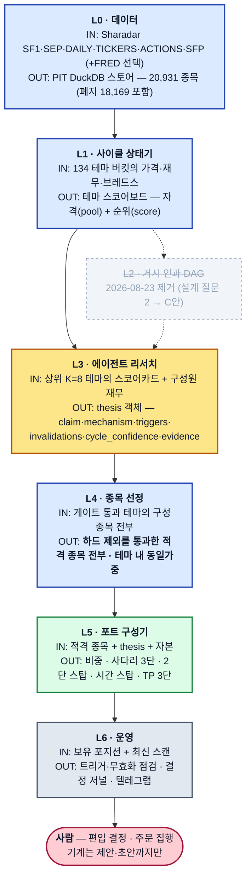
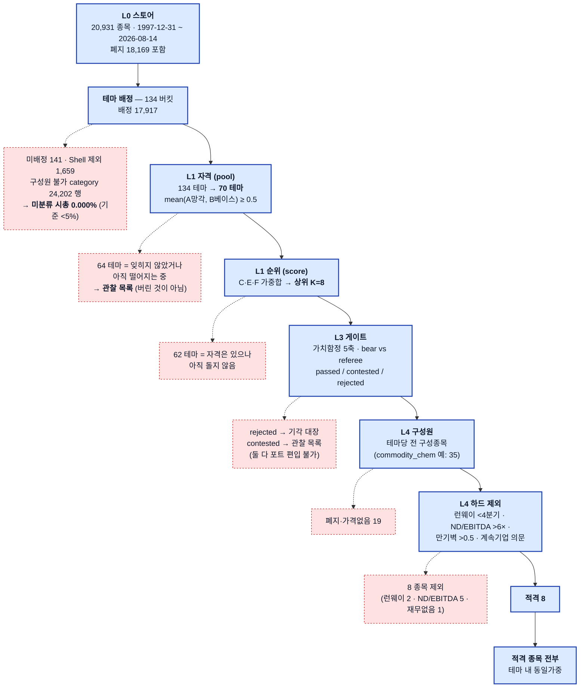
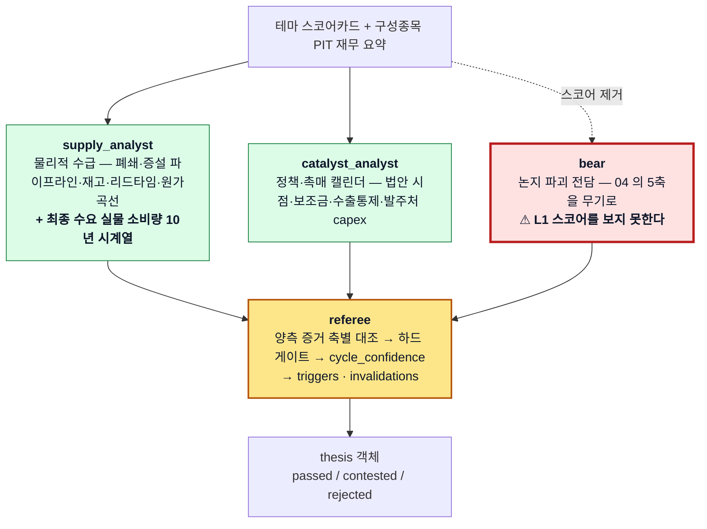
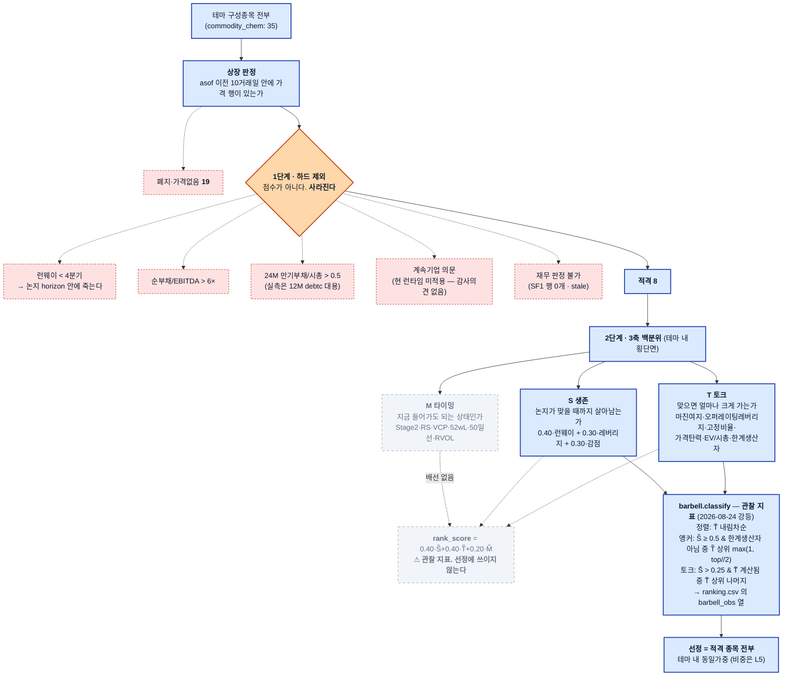

# macro-sector-agent

**아무도 보지 않는 산업 테마를 찾아, 그것이 사이클 저점인지 구조적 사망인지를 가른 뒤, 그 안의 종목 2~4개까지 내려가는 하향식 리서치 파이프라인.**
"지금 무엇을 사야 하는가" 를 먼저 묻지 않는다. **"지금 어느 테마가 잊혀졌는가"** 를 묻고 → **"그것이 돌기 시작했는가"** 로 순위를 매기고 →
**"이건 돌아오는 산업인가 죽는 산업인가"** 를 에이전트가 증거로 다투게 하고 → 살아남은 테마 안에서 **"논지가 맞을 때까지 살아남을 종목"과
"맞으면 크게 가는 종목"** 을 코드가 고른다. 계층은 여섯이며, **거시 계층(L2)은 2026-08-23 에 제거됐다** (`journal/2026-08-23-l2-removed.md`).

> **읽는 순서.** 이 문서를 처음 보는 사람은 §2(깔때기)만 읽어도 "20,931 종목이 어떻게 2~4 종목이 되는가" 를 끝까지 따라갈 수 있다.
> §3 은 각 필터의 정의, §4 는 **무엇이 실제로 검정됐고 무엇이 아직 안 됐는가**, §5 는 명령어다.
> §4 를 건너뛰지 마라 — 이 저장소에서 "구현됐다" 와 "검정됐다" 는 다른 말이다.

## 1. 큰 그림



| 색 | 뜻 |
|---|---|
| 파랑 | **코드가 판단한다** — 결정론·전수. 같은 입력에 같은 출력, 과거로 소급 검정 가능 |
| 노랑 | **LLM 이 판단한다** — 코드가 물리적으로 할 수 없는 것(물리적 수급·정책·대체 위협)만 |
| 초록 | **최적화** — SOCP. 판단이 아니라 예산 배분 |
| 회색 | 운영 · 제거된 계층 |
| 분홍 | **사람** — 기계의 산출은 언제나 제안·초안에서 끝난다 |

**LLM 이 파이프라인의 좁은 허리에만 있는 것이 설계 의도다.** 위(L1)는 전수·결정론이라 싸고 재현 가능하고,
아래(L4·L5)도 결정론이라 훈련 데이터의 유명세 편향이 안 들어온다 (`CLAUDE.md` §4).

### 왜 "섹터" 가 아니라 "테마" 인가

2026년 원자재 사례 — AG(은) · SBSW(PGM) · MP(희토류) · ALM(리튬) — 는 GICS 로 보면 **전부 Basic Materials 한 칸**이다.
드라이버는 넷 다 다르다. 11섹터 해상도로는 이 트레이드가 보이지 않고, 동시에 넷이 같은 잠재 팩터에 로딩된다는 사실도 보이지 않는다.
그래서 분석 단위를 **134개 테마 버킷**으로 잡았다 (`docs/01-theme-universe.md` §3, 정본 `state/themes.yaml`).
그 판단 자체는 재현 가능한 절차가 아니었다 — **이 저장소는 그 절차를 만든다.**

---

## 2. 깔때기 — 20,931 종목이 2~4 종목이 되기까지

**이 절이 이 문서의 핵심이다.** 각 단계에서 **몇 개가 어떤 이유로 빠지는지**를 숫자로 적는다.
`CLAUDE.md` §2("조용한 절단 금지")는 이 저장소가 `portfolio-research` 에서 승계한 규약이고,
**아래 그림은 그 규약의 시각화다** — 요청한 것보다 적게 받으면 예외를 던지거나 경고를 남기고,
제외된 것은 수와 사유가 반드시 리포트에 남는다.



### 숫자의 출처 — 전부 재현 가능

| 단계 | 숫자 | 출처 · 재현 |
|---|---|---|
| L0 스토어 | 20,931 종목 · 폐지 18,169 · 1997-12-31~2026-08-14 | `docs/10-validation.md` §1 |
| 스캔 입력 유니버스 | 19,717 | `state/scans/2026-08-14/meta.json` `membership` — 스토어 전체와 다르다. 스캔은 **오늘의 티커 테이블**을 배정 입력으로 쓴다 |
| 테마 배정 | 134 버킷 · 배정 **17,917** · 미배정 141 · Shell 제외 1,659 | 좌동 |
| 미분류 시총 | **0.000%** (share 1.1e-06) | `meta.json` `unclassified_mcap` · 기준 <5% (`docs/01` §5) |
| L1 자격 | 134 → **70** | `mean(A_pct, B_pct) ≥ 0.5`. `POOL_MIN = 0.5` (`src/msa/l1/scoreboard.py:68`). `state/scans/2026-08-14/scoreboard.csv` 의 `A_pct`·`B_pct` 로 계산 |
| L1 순위 | 상위 **8** | `msa run monthly --top-k 8` 기본값 · `docs/05` §5 (비용 통제) |
| L4 (예: `commodity_chem`) | 구성원 35 → 상장 16 → 하드 제외 8 → **적격 8 = 선정 8** (동일가중) | `uv run msa picks commodity_chem --asof 2026-08-14 --no-write` |

> **디스크의 스캔 산출물은 S2 채택 이전(S0)이다.** `state/scans/2026-08-14/` 는 구 복합 점수로 134 테마 전부에
> 순위를 매긴 기록이다. 위 표의 "70" 은 같은 파일의 `A_pct`·`B_pct` 에 현행 자격 규칙을 적용한 값이고,
> 아래 상위 8 은 현행 코드로 다시 돌린 것이다 (`--no-write`, 새 산출물을 쓰지 않았다).

**2026-08-14 기준 상위 8 (현행 S2 구조, `msa scan --asof 2026-08-14 --no-write`)**

| # | theme | class | score | A | B | C | D | E | F | flags |
|---|---|---|--:|--:|--:|--:|--:|--:|--:|---|
| 1 | `retail_department` | secular_risk | 0.83 | .58 | .78 | .78 | .72 | .91 | .81 | n=4 소표본 · SECULAR 게이트 필요 · axis1 data_missing |
| 2 | `health_it` | secular_growth | 0.81 | .81 | .56 | .83 | .89 | .96 | .76 | SECULAR 게이트 필요 |
| 3 | `home_improvement` | credit_rate | 0.81 | .93 | .74 | .93 | .34 | .87 | .61 | axis1 data_missing |
| 4 | `media_streaming` | secular_growth | 0.80 | .87 | .91 | .74 | .88 | .78 | .88 | SECULAR 게이트 필요 |
| 5 | `shipping_container` | commodity_supply | 0.78 | .33 | .84 | .90 | .64 | .78 | .53 | breadth_lead=1m |
| 6 | `offshore_drilling` | secular_risk | 0.78 | .88 | .14 | .63 | .31 | 1.00 | .73 | SECULAR 게이트 필요 |
| 7 | `managed_care` | policy_program | 0.75 | .73 | .35 | .99 | .50 | .94 | .16 | |
| 8 | `homebuilders` | credit_rate | 0.72 | .56 | .98 | .90 | .33 | .80 | .39 | axis1 data_missing |

> **상위 8 중 3개가 `secular_*` 이고 `SECULAR — 게이트 필요` 플래그를 달고 있다.** 이것이 정상 동작이다 —
> L1 은 "싼 것" 이 아니라 "잊히고 돌기 시작한 것" 을 위로 올리고, **사양 산업인지 아닌지는 L3 의 하드 게이트가 판정한다.**
> 스코어보드 상단에 있다는 것은 후보라는 뜻이지 통과했다는 뜻이 아니다.

---

## 3. 필터를 하나씩

금융 용어를 다 알지 못한다고 가정하고 쓴다. **각 필터가 무엇을 걸러내려는 것인지를 먼저 한 문장으로 말한 뒤** 정의를 준다.

### (a) L1 — 여섯 블록과 S2 집계

134개 테마 각각에 대해 **여섯 가지 질문**을 던지고, 각 질문의 답을 0~1 로 정규화한다 (`docs/02-cycle-state.md`).

| 블록 | 한 줄로 묻는 것 | 대표 지표 |
|---|---|---|
| **A 망각** | 아무도 이걸 안 보는가? | `dd_10y`(10년 고점 대비 낙폭) · `months_since_peak` · `liquidity_decay`(거래대금 위축, SPY 대비) |
| **B 베이스** | 떨어지기를 **멈췄는가**? | `vcp_index`(수축폭 단조 감소) · `rv_ratio`(변동성 수축) · `range_compression` · `decline_angle` · `volume_dryup` |
| **C 턴** | **돌기 시작했는가**? | 아래 별도 |
| **D 밸류** | 자기 역사와 비교해 싼가? | `ev_ebitda_med` · `pb_med` · `fcf_yield_med` 의 10년 자기이력 백분위 |
| **E 자본사이클** | 공급이 파괴되고 있는가? | `capex_to_da < 1.0` 지속 분기 수 · `asset_growth` 음수 · `exit_count`(파산·폐지) · `entry_count`(신규 상장 = 후반 경고) |
| **F 펀더멘털** | 실적이 **감속을 멈췄는가**? | `rev_yoy_d2`(매출 증가율의 2계도함수) · `ebitda_margin_pct` · `unit_cagr_5y`(실물 물량) |

**"경과 시간이 낙폭보다 중요하다"** — A 블록의 `months_since_peak` 가 그 뜻이다. 6개월 만에 −50% 는 패닉이고,
48개월에 걸친 −50% 가 망각이다. 우리가 원하는 것은 후자다.

#### C 블록 — 브레드스가 이 저장소의 구조적 우위

**ETF 만 보는 사람은 지수만 본다. 우리는 Sharadar 로 구성종목을 전부 본다.**
지수가 아직 안 움직여도 **구성종목의 절반이 이미 200일선 위**면 바닥은 지났다는 뜻이다.
지수는 대형주가 지배하고, 대형주는 마지막에 돈다.

| 지표 | 정의 | 쉬운 말로 |
|---|---|---|
| `mom_13612w` | Keller 13612W — 1·3·6·12개월 수익률의 **12·4·2·1 가중평균** | 가중치는 임의가 아니라 **연율화 계수**다 (1개월×12, 3개월×4, …). `src/msa/vendor/taa_signals.py:8` |
| `rs_slope` | `log(테마/SPY)` 의 63일 회귀 기울기 | 시장 대비 이기기 시작했는가 |
| `rs_trough_bounce` | `(테마/SPY)` 현재값 / 252일 최저 − 1 | **상대 저점에서 얼마나 올라왔는가** |
| `breadth_200` | 구성종목 중 종가 > SMA200 인 비율 | 안에서 몇 %가 이미 돌았나 |
| `breadth_nh6m` | 구성종목 중 6개월 신고가 갱신 비율 | |
| `breadth_nhnl` | (신고가 − 신저가) / 구성원 수, 21일 이동합 | 안에서 이기는 쪽과 지는 쪽의 차 |
| `breadth_lead` | `breadth_200` 이 지수의 `above_200` 보다 **몇 개월 먼저** 돌았나 (12 상한) | **이 블록의 핵심 산출물.** 3~6개월이면 "지수는 아직인데 안에서는 이미 돌았다" = 정확히 우리가 원하는 상태 |
| `ew_vs_cw` | 동일가중 지수 / 시총가중 지수의 63일 변화 | 양수 = **소형주가 앞장** = 초기 사이클의 전형 |

#### S2 집계 — 여섯을 더하지 않는다

```
pool  = mean(A, B) ≥ 0.5   →  자격 ("잊혀졌는가" = 입장권)
score = C · E · F           →  순위 ("지금 돌고 있는가" = 등수)
D 밸류                      →  어느 점수에도 안 들어간다 (프로필 표시용)
```

- `pool` 미달 테마는 순위 없이 `[풀 미달(관찰)]` 로 남는다 — **버린 것이 아니라 관찰 목록**이다.
- `score` 는 `cycle_class` 별 가중치 표(`docs/02` §7)의 C·E·F 항을 **재정규화한 가중합**이다. 가중치 값 자체는 바뀌지 않았다.
- 구 복합 점수는 `score_s0` 로 계속 산출한다 (감사·비교용, 순위에 쓰지 않는다).
- 구현: `src/msa/l1/scoreboard.py` (`POOL_BLOCKS`·`POOL_MIN`·`TIMING_BLOCKS`·`aggregate_scores`).

**왜 이렇게 됐나.** M3.5 백테스트에서 **6블록을 한 줄로 더한 복합 점수는 12개월 초과수익의 순서를 몰랐다**
(rank-IC +0.048, 95% CI [−0.024, +0.123] — 0 포함, FAIL). 블록별로 뜯어 보니 산수가 이랬다:

| 블록 | 주 창 12M 단독 rank-IC [95% CI] | 판정 |
|---|---|---|
| A 망각 | **−0.125** [−0.194, −0.031] | **반대로 일한다** |
| B 베이스 | +0.039 [−0.007, +0.088] | 0 |
| **C 턴** | **+0.114** [+0.068, +0.163] | **일한다** |
| D 밸류 | −0.068 [−0.130, +0.008] | 0 |
| **E 자본사이클** | **+0.075** [+0.009, +0.144] | **일한다** |
| F 펀더멘털 | −0.019 [−0.049, +0.009] | 0 |

즉 **C 와 E 가 벌어 놓은 것을 A 가 정면으로 상쇄하고 있었다.** 그런데 `docs/02` 자신이 §A·§8 에서 A 를
*조건*("어디를 볼지", "A↑B↑C↓ = 아직 바닥, 진입 이르다")으로 서술하면서 §7 에서만 *가산 항*으로 집계하는
모순이 있었다. 그 모순을 `docs/12-design-question-a-block.md` 가 설계 질문으로 세우고,
**결과를 보기 전에** 후보 둘(S1 절대 게이트 · S2 풀/타이밍 2단)과 합격 기준을 고정한 뒤 같은 관문으로 쟀다.

| 후보 | 정의 | 주 창 12M IC [95% CI] | 판정 |
|---|---|---|---|
| S0 현행 | A 포함 6블록 가산 | +0.048 [−0.024, +0.123] | FAIL |
| S1 절대 게이트 | `dd_10y ≤ −50% AND months_since_peak ≥ 12` 안에서 B~F | +0.052 [−0.011, +0.144] | **FAIL** — 예측력이 아니라 **희소성** 때문. 175개월 중 120개월에서 후보가 20개 미만이라 IC 를 셀 수조차 없었다 |
| **S2** | `mean(A,B) ≥ 0.5` 자격 · 순위 = C·E·F | **+0.078 [+0.015, +0.145]** | **PASS** |

**S1 이 실패한 자리에서 임계를 −40%/6개월로 풀어 보고 싶어지는 것 — 그것이 `CLAUDE.md` §1 이 막는 바로 그 유혹이다.**
S1 은 거기서 닫았다. 상세는 `docs/backtest-l1.md` §12, 결정 기록은 `journal/2026-08-23-l1-structure-s2-adoption.md`.

### (b) L3 — 가치함정 판별기 (`docs/04-value-trap.md`)

**이 판별기가 없으면 전체 파이프라인이 자본 파괴 기계가 된다.**

L1 스코어보드 상단에 오르는 조건 — 고점 대비 −60%, 4년째 하락, 거래 위축, 밸류 하위 10% — 을 **완벽하게** 만족한 사례들:

| 사이클이었던 것 | 사망이었던 것 |
|---|---|
| 은광 2015-16 · 우라늄 2020-23 · 탱커 2021-22 · 셰일 E&P 2020-22 | 석탄 2012-16 (대형 4사 중 3사 파산) · 오프쇼어 드릴링 2015-20 (전원 챕터11) · 몰/백화점 REIT 2016-20 · 중국 사교육 2021 (단일 규제로 소멸) |

**차트로는 두 그룹이 구분되지 않는다. 밸류에이션으로도 안 된다 — 사망 그룹이 오히려 더 싸다.**
가르는 것은 하나다: **공급이 파괴될 때 수요가 남아 있는가.**

#### 5축

| 축 | 걸러내려는 것 (한 문장) | 정의 |
|---|---|---|
| **1 · 물량 추세** | 가격만 싼 것과 **수요 자체가 줄어드는 것**을 가른다 | 매출이 아니라 **실물 소비량**(톤·온스·MWh·배럴)의 10년 CAGR. 1순위는 외부 실물 시계열(L3 `supply_analyst` 수집), 없으면 **동일 구성원 매출 ÷ 가격지수** 폴백 |
| **2 · 자본사이클** | 공급이 실제로 줄고 있는지 | `capex_to_da < 1` 8분기+ · `exit_count` · `asset_growth < 0`. **이 축 단독으로는 판별 불가** — 공급 파괴는 사망에서도 일어난다 |
| **3 · 대체 위협** | "이번엔 다르다" 가 진짜인지 | 대체 기술의 **침투율**과 **비용 교차점**. 자본재 교체 주기가 20년이면 되돌아오지 않는다 |
| **4 · 원가곡선** | 반등이 **물리적 필연**인지 | 현재 가격 < 산업 P90 현금원가 → 셧다운이 회계적으로 강제된다. 다만 이 축은 **"반등한다"** 만 말하고 **"진입 가능하다"** 는 말하지 않는다 |
| **5 · 잔존 위험** | 논지가 맞아도 **그때까지 살아남는가** | 24개월 만기부채/시총 · 자산 재활용성 · 단일 규제 소멸 리스크 · 지리적 집중 |

**축 1 의 함정과 그 수리.** 테마 **합산** 매출로 물량을 재면, 파산·합병으로 구성원이 줄 때 물량도 같이 줄어
**공급 파괴가 심할수록 자동으로 "사망" 판정이 난다.** 그런데 같은 사실(`exit_count` 높음)을 축 2 는 "사이클" 근거로 읽는다.
두 축이 같은 관측을 반대로 해석하고, 축 1 이 하드 게이트를 쥐고 있으므로 **진짜 사이클 저점일수록 자동 기각된다.**
그래서 입력을 **동일 구성원(same-store)** — 측정 구간의 양 끝에 **모두 존재하는 기업**만 — 으로 고쳤다.
`ss_n`·`ss_coverage`·`ma_flag` 표기는 필수다 (표기가 없으면 조용한 절단, `CLAUDE.md` §2).
**임계값은 바뀌지 않았다** — 고친 것은 입력의 정의이지 판정 임계가 아니다.

**축 1 을 쓸 수 있는 테마는 134 중 45개다** (`physical_ref` 보유). 나머지 **89개에서는 가장 결정적인 축이
결정론적으로 계산되지 않고, 판별의 중심이 축 3(LLM 판정)으로 넘어간다.** 게이트를 쥔 축이 LLM 이 되는 것이므로
`axis1_available = false` 를 리포트에 숨기지 않는다.
(2026-08-14 실측: 선언 45 중 **데이터 있음 7 · 없음 38** — `FRED_API_KEY` 부재가 원인이다.)

#### 하드 게이트

```
# 이 분기를 가장 먼저 평가한다 — 게이트 보류가 다른 판정에 선행한다
IF  verdict_pre_ss ≠ verdict_post_ss  OR  sign_split:
        → axis1_contested. 기각도 통과도 아니다 → referee 검토

IF  축1 == 사망  AND  축3 ∈ {경고, 사망}:
        → 자동 기각. L1 스코어 무관

IF  축1 == 사망  OR  축3 == 사망:
        → cycle_confidence 상한 0.35 → 포트 편입 불가 (최소 확신도 0.5). 관찰 목록만

IF  24M 만기부채/시총 > 0.5:
        → 테마는 유지, L4 에서 해당 종목만 제외

ELSE:   cycle_confidence = f(축1..축5)
```

`cycle_class == secular_risk` 인 9개 버킷은 **게이트를 기본 적용**한다 — 통과를 입증해야 후보가 된다.
사양 낙인이 아니라 **입증 책임의 전환**이다.

#### `cycle_confidence` 산술

**확신도는 자유 서술이 아니라 산술이다.** referee 는 아래 표를 기계적으로 적용하고, 표 밖의 조정이 필요하면
조정 대신 `key_uncertainties` 에 서술로 남긴다.

| 항 | 조건 | 계수 |
|---|---|--:|
| base | | **0.50** |
| 축1 | 사이클 (물량 성장 중) | +0.15 |
| 축2 | `capex/D&A < 1` 이 8분기+ | +0.10 |
| 축3 | 대체 위협 없음 | +0.15 |
| 축4 | 가격 < P90 원가, 셧다운 발표 관측 | +0.10 |
| 축1 | 경고 | −0.20 |
| 축3 | 경고 | −0.15 |
| 축5 | 심각 | −0.15 |
| — | 소표본 버킷(n<5) 또는 자기이력 < 7년 | −0.10 |

값역 [0, 1] 로 클립. **계수는 선언이며 탐색하지 않는다.**
2026-08-23 에 거시 순풍 항(+0.10)이 삭제됐다 — 값을 조정한 것이 아니라 **L2 제거로 입력이 사라진** 것이다.

#### 4역할과 bear 격리



> **bear 의 성공 조건은 논지를 죽이는 것이다. 균형 잡힌 시각을 요구하지 않는다** — 균형은 referee 가 잡는다.
> 그래서 bear 는 **독립 컨텍스트에서 실행하고 입력에서 L1 스코어를 숨긴다.**
> "이건 스코어 상위 테마다" 라는 프레이밍 자체가 강세 편향이고, **bear 가 온건해지면 판별기 전체가 무력해진다.**

**오늘의 실제 예 — `commodity_chem` (범용석유화학), `state/theses/2026-08-23/`.**
bear 가 찾아낸 것: **2026년 세계 에틸렌 순증 능력 14.6 Mt** — 직전 5년 평균의 약 2배로 사상 최대이고 그중 56%가 중국이다.
같은 해 **유럽 크래커 순감축은 505 kt** 에 그친다 (Dow Böhlen · TotalEnergies Antwerp · Sabic 폐쇄를
INEOS Project ONE 1,450 kt 신규가 상쇄). 즉 **상장 서구 표본 안에서는 공급 파괴가 진짜로 진행 중이지만,
산업 수준에서는 순증이 계속된다.** referee 는 게이트를 `passed`(축1 사이클 · 축3 경고 · 축5 경고,
`cycle_confidence` 0.70)로 닫았으나, **`horizon_months` 를 [24, 60] 으로 잡았다** — 수급 균형 회복이
사이클 지평(6~18개월) 밖, 2030년대 초반이라는 뜻이다. 증거 31건, 전부 `source_url` 을 갖췄다.
이것이 bear 격리가 실제로 하는 일이다: 논지를 죽이지는 못했지만 **시점을 6년 뒤로 밀어냈다.**

**규약**: `evidence` 배열이 비면 저장 거부 (`CLAUDE.md` §3 — LLM 의 기억은 증거가 아니다).
`invalidations` 가 비어도 저장 거부 (§5 — 무효화 조건을 못 쓰겠으면 그건 논지가 아니라 희망이다).
**게이트 기각된 thesis 는 저장한다** — 스키마 미달(불완전한 산출물)과 게이트 기각(완전한 산출물에 대한 판정)은 다르고, 후자는 감사 대상이다.

### (c) L4 — 종목 필터는 2단계다



**1단계 — 하드 제외.** 스코어가 아니다. **아무리 토크가 커도 4분기 안에 현금이 마르는 기업은 후보에서 사라진다.**

| 필터 | 임계 | 실측 (`commodity_chem` 2026-08-14) |
|---|---|---|
| `cash_runway_q` | **< 4분기 하드 제외** | ASIX 1.12q · FMST 1.09q |
| `net_debt_ebitda` | > 4× 감점, **> 6× 하드 제외** | TROX 39.7× · CE 25.2× · RYAM 8.9× · HUN 7.0× · DOW 6.6× |
| `maturity_wall_24m` | **> 0.5 하드 제외** | 실측은 `debtc`(12개월 내)/시총 대용 — SF1 에 24개월 스케줄이 없다. 13~24개월 벽은 놓친다 |
| `going_concern` | **하드 제외** | **미적용** — 감사의견이 스토어에 없다. `inputs_unavailable` 에 매번 표기 |
| 재무 판정 불가 | 하드 제외 | BAK (SF1 행 0개 — 20-F 해외발행사). **판정 불가를 통과로 두지 않는다** |

**2단계 — 3축, 그리고 왜 하나로 안 합치나.**
`docs/06` §1 이 이 저장소에서 가장 자주 인용되는 문장을 갖고 있다:

> 사이클 저점의 이 산업에서는 **대부분의 기업이 적자**고, 밸류 팩터는 분모가 음수라 무의미하고,
> **퀄리티 팩터는 정확히 반대 방향을 가리킨다 — 우량주가 가장 덜 오른다.**

**그래서 "섹터를 고르고 그 안에서는 대장주를 산다" 가 기본값이 아니다.**
S(생존)와 T(토크)는 **구조적으로 상충한다** — 저비용 대형 생산자는 안 죽지만 3배 안 가고,
고비용 레버리지 생산자는 5배 가지만 그 전에 파산할 수 있다.
합산하면 둘 다 아닌 중간이 나온다. 그래서 **합산하지 않고 바벨로 나눈다.**

> **2026-08-24 — 아래 바벨은 더 이상 선정하지 않는다.** 사전 등록된 구조 비교(`docs/15`)에서
> **B0(바벨)·B1(시총 상위 3)·B2(토크 상위 3) 중 아무도 B3(하드 제외 통과 전부 동일가중)를
> 이기지 못했고**, `docs/15` §5 가 결과를 보기 전에 정해 둔 조치가 발동했다 — **선정 규칙을
> 버리고 하드 제외만 남긴다.** 사용자가 집행을 결정했다. 아래 표의 규칙과 임계는 **하나도
> 옮기지 않았고**, `ranking.csv` 의 `barbell_obs` 열에 **관찰 지표**로 계속 실린다.
> 전문: `journal/2026-08-24-l4-selection-retired.md` · `docs/06` §5.1·§6.1.
>
> 위 §1 의 논거(우량주가 가장 덜 오른다 · S와 T의 상충)는 **지우지 않는다** — 반증된 것은
> 이 표본·이 창에서의 예측력이지 서술 전체가 아니고, 이 검정이 **비중·물타기 여력·L3
> 확신도·거래비용을 원리적으로 못 본다** (`docs/15` §6).

| 그룹 | 선정 기준 (2026-08-24 이후 **관찰용**) | 역할 | 테마 내 비중 |
|---|---|---|---|
| **앵커 (survivor)** | S̃ ≥ 0.5 & 한계생산자 아님 중 T̃ 최고 | 논지가 늦게 맞아도 안 죽는다. **물타기 여력의 근거** | 55~70% |
| **토크 (torque)** | S̃ > 0.25 & T̃ 계산됨 중 T̃ 상위 | 논지가 맞을 때의 수익 대부분 | 30~45% |

> 2026년 원자재 트레이드의 사후 진단: AG·SBSW·MP·ALM 은 **4개 전부 토크 그룹**이었다. 앵커 0개는 설계가 아니라 우연이었을 가능성이 높다.
> 앵커 0% 를 금지하지는 않지만, 리포트는 매 구성마다 **앵커/토크 비율을 명시**해 그 선택이 의도적이도록 만든다.

#### 정직하게 — `rank_score` 는 배선돼 있지 않다

`docs/06` §6 은 종합 점수를 선언한다:

```
rank_score = 0.40·S̃ + 0.40·T̃ + 0.20·M̃
```

**이 점수는 종목 선정 경로에 들어가지 않는다.**

- `src/msa/l4/picks.py:114-115` — 3축 백분위·`composite`·`rank` 를 만든 뒤 **적격 종목 전체**를 `classify()` 에 넘긴다. 상위 N 으로 자르지 않는다.
- `src/msa/l4/barbell.py:67-85` — `classify()` 가 보는 것은 `t_pct` · `s_pct` · `marginal_producer` **셋뿐**이다. `composite` 도 `rank` 도 참조하지 않는다.
- L5 로 넘어가는 `rank_score` 열(`src/msa/pipeline/assemble.py:266`)도 `src/msa/l5/` 의 어느 모듈도 읽지 않는다.

따라서:

1. **가중치 0.40/0.40/0.20 은 아무 것도 결정하지 않는다.** 어떤 값으로 바꿔도 `msa picks` 가 고르는 종목은 같다. 바뀌는 것은 리포트의 등수뿐이다.
2. **M(타이밍) 축은 선정에 전혀 관여하지 않는다.** `docs/06` §4 는 M 을 "순위 조정과 사다리 1단의 시점 힌트로만 쓴다" 고 적었지만, **그 "순위" 가 선정과 무관한 표시용 등수**라는 점은 문서 어디에도 없었다. 사다리 1단 힌트 쪽도 배선돼 있지 않다.
3. **실제 선정 규칙은 둘이다** — (a) 하드 필터의 절단, (b) **T̃ 정렬 + S̃ 문턱(0.5 / 0.25) + 한계생산자 제외**. S̃ 는 순위가 아니라 **문턱**으로만 쓰이고, 순서를 정하는 것은 T̃ 하나다.

`commodity_chem` 실측이 이것을 그대로 보여 준다 — 바벨에 뽑힌 넷은 `#7 WLKP`(앵커) · `#2 REX`(앵커) · `#5 GURE`(토크) · `#1 ACNT`(토크) 이고,
**표시 등수 #3·#4·#6·#8 은 뽑히지 않았다.**

> 이 발견은 **결정이 아니다.** L4 를 존치할지, `rank_score` 를 뺄지, M 축을 배선할지 — 아무것도 정하지 않았다.
> 코드도 한 줄 고치지 않았다 (L4 백테스트가 실행 중이고, 고치면 그 실행이 무효가 된다).
> 전문은 `journal/2026-08-23-l4-rank-score-unwired.md`, 백테스트 해석에 미치는 영향은 `docs/14` §1 Q1 각주·§4.1.

#### 2026-08-24 — 그래서 무엇을 했나

검정이 끝났고 **사용자가 선정 규칙을 버리기로 정했다.** 위 (a)~(c) 의 서술은 기록으로 남기고,
오늘 도는 규칙은 이것 하나다:

> **하드 제외를 통과한 적격 종목 전부 · 테마 내 동일가중.**

판정(`docs/backtest-l4.md`·`docs/15` §4) — 전부 **스코어의 예측력과 구조 간 차이**이지 전략
수익률이 아니다 (`CLAUDE.md` §7):

- **Q1 FAIL** — `rank_score` 주 창 12M rank-IC **+0.0144 [−0.0008, +0.0266]** (CI 가 0 을 포함)
- **Q2** — S̃ **+0.0449** [+0.0203, +0.0658] 일한다 / T̃ **−0.0425** [−0.0699, −0.0162]
  **반대로 일한다** / M̃ **+0.0327** [+0.0096, +0.0539] 일한다
- **Q3** — E1·E2·E3 의 초과수익 차 CI 는 0 을 포함(알파 아님)하나 **사망률 차 CI 하한이 셋 다
  0 을 넘었다** — 필터가 막겠다고 한 것을 막았다. **그래서 임계를 옮기지 않는다**
  (`docs/14` §4.2 넷째 행)
- **`docs/15` §4** — B0−B3 **+0.76%p [−0.29, +2.76]** · B1−B3 **+0.92%p [−2.36, +4.48]** ·
  B2−B3 **+0.86%p [−2.25, +5.30]**. **셋 다 0 을 포함한다**

무엇이 바뀌지 않았는지: **하드 제외 임계 · 축 정의 · 3축 계산 · `AXIS_WEIGHTS` ·
`ANCHOR_S_MIN`(0.5) · `TORQUE_S_EXCLUDE_LE`(0.25) · `ranking.csv` 의 어느 열도.** `barbell_obs`
열이 **추가**됐을 뿐이다. **동일가중은 가중치를 정한 것이 아니라 정하지 않은 것이다.**

**열린 질문 — 운용 가능한 K 는 정해져 있지 않다.** B3 는 적격 종목을 전부 보유하고, 그것은
실제 운용과 맞지 않는다. B1 이 B3 와 구분되지 않았다는 이유로 지금 K=3 을 고르는 것은 **사후
선택**이다 (`docs/15` §5.1). **새 사전 등록이 필요하다** (`docs/06` §6.2).

### (d) L5 — 사다리와 스탑

**물타기가 가능하다는 제약이 설계를 지배한다.** 진입 정밀도 요구가 낮아지는 대신, **사다리 전액이 예산 안에 들어가야 한다.**

**⚠ 물타기는 가격이 아니라 논지 상태에 조건부다.** 무효화 트리거가 하나라도 발동하면 추가 매수 금지, 청산 검토로 전환한다.
**가격만 보고 물타는 것이 가치함정에서 자본이 사라지는 정확한 경로다.**

| 단계 | 목표비중 대비 | 발동 조건 (**둘 다** 필요) |
|---|---|---|
| 1단 진입 | 50% | 논지 확정 시점 |
| 2단 추가 | 30% | 가격 −12~15% **AND** 무효화 0건 **AND** 트리거 1건 이상 충족 |
| 3단 추가 | 20% | 가격 −22~25% **AND** 무효화 0건 **AND** 트리거 진행 중 |

확신도 연동: `c ≥ 0.75` → 60/25/15 · `c ∈ [0.6,0.75)` → 50/30/20 · `c ∈ [0.5,0.6)` → 35/35/30 (확신이 낮을수록 뒤로 미룬다).

스탑은 셋이다. **가격 스탑 하나만 두면 사이클 논지 + 물타기와 자기모순이다** (물타는 지점에서 스탑이 걸린다).

| 종류 | 발동 | 조치 |
|---|---|---|
| **Tier 1 · 논지 스탑** | `thesis.invalidations` 중 1건 관측 | **즉시 전량 청산. 가격 무관** |
| **Tier 2 · 자본 스탑** | 사다리 평단 −35%, 또는 포지션 손실이 총자본의 8% | 전량 청산 |
| **시간 스탑** | **기준일 + `horizon_months[1]`(상한) 경과 AND 충족 트리거 0건** | 전량 청산 |

> **시간 스탑이 가장 자주 무시되고 가장 중요하다.** 가치함정은 급락으로 자본을 죽이지 않는다. **정체로 죽인다.**
> 18개월 동안 −10% 에 머문 포지션은 손실이 작아 보이지만, 그 기간의 기회비용과 심리적 앵커링이 다음 사이클을 놓치게 만든다.
> **트리거가 하나도 안 맞았다는 것은 메커니즘이 틀렸다는 뜻이다.**

Tier 2 의 −35% 는 예산에서 역산한 값이다 — 테마 상한 0.35 × 손실 0.35 = 총자본 12.25%, MDD 예산 30% 의 41%.
**탐색해서 얻은 값이 아니다.**
익절은 3단 (TP1 P50 회복 또는 +2R → TP2 P75 또는 직전 사이클 고점 50% 회복 → 러너 트레일링),
TP1 체결 후 Tier 2 를 본전으로 상향하면 그 분이 MDD 예산에서 해제돼 **새 테마 편입 여력이 생긴다.**
상세는 `docs/07-portfolio.md` §3~§5.

---

## 4. 무엇이 증명됐고 무엇이 안 됐나

**이 절에는 성과 수치가 없다** (`CLAUDE.md` §7). 있는 것은 **검정 결과**뿐이다.
L1·L4 의 백테스트는 **스코어의 예측력**(rank-IC)을 재는 것이지 전략의 수익률을 재는 것이 아니다 —
L5(사이징·사다리·스탑)와 L3(확신도)이 백테스트 불가라 **전략 수익률이라는 물건 자체가 만들어지지 않는다.**

| 계층 | 백테스트 | 현재 상태 |
|---|---|---|
| **L1 사이클 스코어보드** | **가능** — 입력이 가격·재무제표뿐 | **완료.** 관문 0(M3.5) FAIL → 구조 검정(M3.6) 후 S2 PASS |
| ~~L2 거시 DAG~~ | (제거) | 2026-08-23 |
| **L4 종목 선정** | **가능** — S·T·M 이 전부 재무·가격 파생 | **완료 (2026-08).** Q1 **FAIL** → `rank_score`·바벨 선정 폐기, 하드 제외만 남김 (`docs/backtest-l4.md` · `docs/15` §4) |
| L5 사다리·스탑 | **시뮬만** — 경로 의존, 표본 적음 | **참고치이지 관문이 아니다** |
| **L3 에이전트 리서치** | **불가** | 2015년의 정책·광산 폐쇄·재고를 오늘의 지식 없이 재구성할 수 없다 |
| **축 3 대체 위협** | **불가** | 좌동. 그래서 판별의 무게가 여전히 사람·에이전트에 있다 |
| `cycle_confidence` | **불가** | L3 산출물. `docs/10` §4 캘리브레이션(Brier score)이 담당한다 |
| **전체 파이프라인 통합** | **존재하지 않고 앞으로도 불가능** | 위 세 줄이 불가인 이상 통합 수익률은 정의되지 않는다 |

### L1 — 측정값

**주 창(2011–) · 12개월 호라이즌 · S2 구조의 테마 횡단면 rank-IC:**

```
+0.078   95% CI [+0.015, +0.145]     N = 175개월 · N_eff = 25.3
```

**CI 하단이 +0.015 다. 0 을 겨우 넘는다.** 이것이 이 숫자를 읽는 유일한 정직한 방법이다.

같이 적어야 하는 한계 — `docs/backtest-l1.md` §12 가 결과와 함께 고정해 둔 것들:

| 눈금 | 값 | 뜻 |
|---|---|---|
| 전 창·호라이즌 | 6칸 전부 CI 하한 > 0 (주 3M +0.063 · 6M +0.079 · 12M +0.078) | 한 칸만 맞은 것이 아니다 |
| **DSR** (632 시도, 비중첩 15관측) | **0.003** | **"0 과 구분된다" 이지 "632번 본 중 우연이 아니다" 까지는 아니다.** 15개 비중첩 관측으로는 632 시도를 이길 수 없다 |
| 12M top8−bottom8 스프레드 | **+2.9%p [−5.0, +10.9] — 0 포함** | 실제로 쓰는 컷오프에서 12개월 스프레드는 0 과 구분되지 않는다 (1/3/6M 은 CI > 0) |
| `commodity_supply` 클래스 | +0.095 [−0.037, +0.205] | **이 저장소의 원형인 원자재 클래스에서는 S2 도 0 과 구분되지 않는다** |

> **합격은 "한 경로에서 어긋나지 않았다" 이지 "맞았다" 가 아니다.**
> 표본이 사실상 하나(1998~2026 미국 단일 경로)이므로 이 구조도 다음 검정에서 틀릴 수 있고,
> 그때 하는 일은 값을 고치는 것이 아니라 **기록하는 것**이다.
> 되돌리는 조건은 미리 적혀 있다 — 다음 관문에서 주 창 12M CI 하한이 0 아래로 내려가면 새 절로 기록하고, 되돌릴지는 사람이 다시 결정한다.

### L4 — 측정값

`docs/14-l4-backtest-preregistration.md` 가 실행 **전에** 질문·지표·합격 기준·시도 수를 못박았고,
**최초 실행은 2026-08 에 끝났다** — 판정은 `docs/backtest-l4.md`, 선정 구조 비교는 `docs/15` §4,
그 결과가 촉발한 조치는 위 §3(c) "2026-08-24" 절. 여기 적는 것은 **IC 와 그 신뢰구간**이며
전략 수익률이 아니다.

**주 창(2011–) · 12개월 호라이즌 · 테마 내 rank-IC:**

| # | 질문 | 합격 기준 | 결과 | 판정 |
|---|---|---|---|---|
| **Q1** | `rank_score` 가 테마 내 순서를 아는가 | 주 창 12M rank-IC 의 95% 블록부트스트랩 **CI 하한 > 0** | **+0.0144 [−0.0008, +0.0266]** | **FAIL** — CI 가 0 을 포함한다 |
| **Q2** | S·T·M 각 축 단독 IC | CI 하한 > 0 = "일한다" / 상한 < 0 = "반대로" / 0 포함 = "0". **관문이 아니다** | S̃ **+0.0449** [+0.0203, +0.0658] · T̃ **−0.0425** [−0.0699, −0.0162] · M̃ **+0.0327** [+0.0096, +0.0539] | S̃·M̃ 일한다 / **T̃ 는 부호가 반대다** |
| **Q3** | 하드 필터가 손실을 막았는가 | E1·E2·E3 각각 `제외군 − 통과군` 12M 초과수익 차의 CI **상한 < 0** | 초과수익 차 CI 가 셋 다 0 을 포함. 병기한 **사망률 차는 셋 다 CI 하한 > 0** (E1 +5.5%p · E2 +6.7%p · E3 +13.0%p) | **알파가 아니라 표본 절단.** 다만 **메커니즘은 확인됐다** — 그래서 임계를 옮기지 않는다 |
| **Q4** | 지표 단독 | 판정 없음. 표로만 | `docs/backtest-l4.md` §6 | — |

**DSR** — N=1(사전 선언, 비중첩) **0.755** / N=458(이 리포트가 본 모든 칸) **0.022**.
15개 비중첩 관측으로 458 시도를 이길 수 없다 (`docs/backtest-l4.md` §8).

**그래서 무엇을 했나**: `rank_score`·`rank`·3축 백분위·바벨 라벨을 **관찰 지표로 강등**하고,
선정 규칙을 **"하드 제외 통과 종목 전부 · 테마 내 동일가중"** 으로 바꿨다. `docs/15` §4 에서
B0·B1·B2 중 **아무도 B3(동일가중)를 이기지 못했다** (셋 다 CI 가 0 을 포함). 조치는 결과를
보기 전에 `docs/14` §4.2 · `docs/15` §5 에 적혀 있던 것이고, **하드 제외 임계와 축 가중치는
하나도 옮기지 않았다.**

**같이 읽어야 하는 한계** — `docs/backtest-l4.md` §10 이 결과와 함께 고정해 둔 14개 중 셋:
`price_beta_hist` 결측률 99.0%(T 축 판정이 설계 실패인지 입력 결측인지 구분되지 않는다) ·
`net_debt_ebitda` 가 두 단위 공간에 사는데 임계는 하나(#12) · E2·E3 의 **판정 불가가 이
실행에서는 통과였다**(#13 — 2026-08-24 에 E6·E7 로 분리했으므로 다음 실행의 적격군은 더 작다).

**단, Q1 이 재는 `rank_score` 는 위 §3(c) 대로 실제 선정에 쓰이지 않는 표시용 등수다.**
합격이든 실패든 그것은 "리포트가 표시하는 등수가 순서를 아는가" 에 대한 답이지 "`msa picks` 가 고르는 종목이 좋은가" 에 대한 답이 아니다.
**실제 선정 규칙에 대응하는 것은 Q2(S̃·T̃ 단독 IC)와 Q3(하드 필터)이다.**
그럼에도 **Q1 은 1차 지표 자리에 그대로 두고 Q2·Q3 을 승격하지 않았다** — 지위는 결과를 보기 전에 정해졌고 실행 중에 바꾸지 않는다.

### 백테스트할 수 없는 절반은 어떻게 하는가

관문을 **사전 반증가능성(ex-ante falsifiability)** 으로 옮긴다.
모든 테마 논지는 *관측 가능한 트리거* 와 *무효화 조건* 없이는 **저장될 수 없고**(스키마가 거부한다),
그 절반의 검증은 **전향적 기록**(`journal/`, append-only)과 **확신도 캘리브레이션**(Brier score, `msa ops calibration`)이 한다.
캘리브레이션은 N < 20 이면 "결론 없음" 을 낸다 — 표본이 쌓이기 전에는 아무 말도 하지 않는다.
기각 대장(`state/rejections.yaml`)은 기각한 테마의 12·24개월 수익률을 분기마다 갱신한다 — **기각이 옳았는지도 검증 대상이다.**

---

## 5. 쓰는 법

### 준비

```bash
make install                 # uv sync — 패키지 관리는 uv. pip install 하지 않는다
make check                   # ruff + mypy + pytest (data/net 마커 제외)
msa data status              # 스토어 상태·결측률
msa data audit               # 커버리지 감사 (데이터 부분)
```

데이터는 `~/data/us_micro.duckdb`(Sharadar) 이며, 없으면 `docs/08-data-contract.md` §6 부트스트랩 절차를 먼저 밟는다.

### 환경변수 — 없으면 어떻게 되는가

| 변수 | 없으면 | 영향 |
|---|---|---|
| `SHARADAR_API_KEY` | **아무것도 못 한다** | L0 적재 자체가 불가. 스토어가 이미 있으면 스캔·백테스트는 돈다 |
| `ANTHROPIC_API_KEY` | `msa research` 실제 실행 불가 | `--dry-run`(Mock) · `--provider fixture` 로 배관은 돈다. `msa run monthly` 기본값이 `--provider none` 인 이유가 이것이다 — L3 를 부르지 않고 사람 논지/직전 thesis 만 찾는다 |
| `FRED_API_KEY` | L1 축 1 실물 참조·CPI 가 `data_missing` | **중단하지 않는다.** `dd_real`(실질 낙폭) 미계산, 축 1 선언 45 테마 중 데이터 있음 7 / 없음 38, L4 `price_beta_hist` NaN |
| `MSA_TELEGRAM_TOKEN` + `MSA_TELEGRAM_CHAT_ID` | 배달 "not configured" | 둘 다 있을 때만 보낸다. 리포트는 파일로 남는다 |

> 현재 실측 블로커는 `FRED_API_KEY` 와 `ANTHROPIC_API_KEY` 둘이다.

### 계층별로 하나씩

```bash
msa scan                     # L1 — 134 테마 스코어보드
                             #   --asof --force --no-vcp --top N
                             #   → state/scans/<date>/ (scoreboard.csv·indicators.csv·coverage.csv·report.txt·meta.json)

msa research <theme>         # L3 — 4역할(supply·catalyst·bear·referee) → thesis 객체
                             #   --dry-run (Mock) · --provider fixture|anthropic
                             #   → state/theses/<date>/ (<theme>.thesis.yaml·<theme>.report.md
                             #      ·rejections-pending.yaml·contested.json)
                             #   스키마 미달은 저장하지 않고 종료 코드 2. 게이트 기각은 저장한다

msa picks <theme>            # L4 — 하드 필터 → S·T·M 3축 → 바벨
                             #   --asof --top --no-write --no-physical
                             #   → state/picks/<date>/<theme>/ (ranking.csv·excluded.csv·report.txt·meta.json)

msa portfolio-inputs --asof DATE --themes a,b,c
                             # 배선 — L4 picks + L3/사람 thesis → L5 입력 묶음
                             #   → state/portfolio_inputs/<date>/ (picks.csv·theses/·assemble_report.json·report.txt)

msa portfolio --inputs <dir> # L5 — SOCP + 사다리·스탑·TP + 매매계획서
                             #   --asof --cases --capital --cluster-cap name=cap --no-write
                             #   → state/portfolio/<date>/ (weights.csv·plan.md·diagnostics.json)
                             #   --emit-positions: 미체결 제안(positions-proposal.yaml·.md)
                             #     — state/positions.yaml 은 건드리지 않는다. 승격(status open)은 사람이
```

### 케이던스 — 한 명령으로

```bash
msa run monthly              # 월간 (의사결정 주기): scan → 상위 K → research → ingest → picks → assemble → portfolio(제안)
                             #   --asof --top-k 8 --themes a,b --provider none|mock|fixture|anthropic
                             #   --human-theses DIR --capital N --skip-research/-picks/-portfolio --no-write
                             #   → state/runs/<date>/ (monthly-report.md·run.json)
                             #   단계별 ok|skipped|unavailable|failed 와 사유를 남긴다. 끝은 제안·초안

msa run weekly               # 주간 (점검 주기): 전수 스캔 + msa check --weekly + weekly-report.md
msa run daily                # 일간: 후보 다이제스트 (스캔→상위 K→테마별 L4 랭킹→직전 diff→보유 점검)
                             #   --per-theme 5 --send → state/daily/<date>/ (digest.json·digest.md·report.txt)
                             #   읽기 전용 후보 뷰. 결정 케이던스는 월간 그대로다
msa run quarterly            # 분기: ops calibration · ops rejections-update 를 나열만
```

### 점검 · 저널 · 운영

```bash
msa check                    # 포지션 점검 — 트리거·무효화·Tier-2·사다리·시간스탑·TP
                             #   --asof --daily|--weekly → state/checks/<date>/ (report·alerts.json·journal-draft)
                             #   주문은 내지 않는다
msa journal new --from f.yaml   # 저널 항목 추가 (필수 필드 비면 거부 · 덮어쓰기 불가)
msa journal verify           # journal/ append-only 검사 (pre-commit: scripts/journal-precommit.sh)
msa journal diff <theme>     # 최근 두 thesis 스냅샷 필드 diff (논지 표류 추적)
msa ops ingest-theses --theses-dir state/theses/<date> [--scan state/scans/<date>]
                             #   L3 라운드 → 저널 기각 항목·기각 대장·관찰 목록·진입 초안
msa ops calibration          # cycle_confidence 캘리브레이션 (N<20 → 결론 없음)
msa ops rejections-update    # 기각 대장 r_12m/r_24m 갱신 → state/rejections-summary.md
msa ops reproduce <date>     # state/scans/<date>/ 스냅샷만으로 리포트 재생성·대조
msa ops schedule --print-cron   # 케이던스 → crontab/systemd 텍스트 (설치는 사람이)
```

### 백테스트 — 관문이지 튜닝 루프가 아니다

```bash
msa backtest l1              # 관문 0 (M3.5) — rank-IC·스프레드·breadth_lead·DSR/PBO
                             #   → state/backtests/l1/<date>/ · 판정 docs/backtest-l1.md
msa backtest l1-structures   # M3.6 — 집계 구조 S0/S1/S2 (docs/12 §4 사전 등록)
msa backtest l4              # docs/14 사전 등록의 집행 — 테마 내 rank-IC·축 단독·하드 필터
                             #   --jobs N 병렬 · 테마별 parquet 캐시라 중단해도 이어서 돈다
```

### 실패 시 동작

| 상황 | 동작 |
|---|---|
| 데이터 적재 실패 | **스캔 중단.** 부분 데이터로 스코어를 내지 않는다 |
| 커버리지 감사 실패 (미분류 시총 ≥ 5% 등) | **스캔 중단** + 알림 |
| FRED 시리즈 결측 | 해당 테마 `axis1_status = data_missing`, `cpi: missing` 표시. **중단하지 않음** |
| 에이전트 스키마 검증 실패 | 해당 테마 thesis 없음 → 후보 제외 + 사유 기록 |
| 최적화 infeasible | 제약 완화 순서 **고정**: C3(집중도) → C1(MDD). **MDD 는 마지막까지 지킨다** |

---

## 6. 지배 규약 (`CLAUDE.md` §1~§8)

### §1 탐색으로 가중치를 정하지 않는다 — 이 프로젝트의 중심

`portfolio-research` 의 지배적 실패는 "조용한 절단" 이었다. **이 저장소의 지배적 실패는 오버피팅이 될 것이다.**

왜 관문(DSR·PBO)이 이 규칙을 대체하지 못하는가:

1. **표본이 사실상 하나다** — 1998~2026 미국 시장이라는 단일 경로. 여기에 맞춰 가중치를 옮기면 그 경로에 대한 오버피팅이고, DSR·PBO 는 그것을 잡지 못한다.
2. **사람의 탐색은 어디에도 기록되지 않는다** — `portfolio-research` 가 35회 탐색을 정산할 수 있었던 것은 그 35회가 **스크립트로 남았기** 때문이다. 여기서 일어날 탐색은 사람의 머릿속에서 일어나고, DSR 의 시도 수에 계상할 방법이 없다.
3. **L3 는 아예 백테스트가 불가능하다.**

> **결론은 하나다 — 오버피팅할 기회 자체를 구조적으로 막아야 한다.**
> L1 블록 가중치, L4 축 가중치는 **선언하고 근거를 적는다.** 데이터에 맞춰 조정하지 않는다.

- 파라미터 스윕 · 그리드 서치 · "성과가 좋아지는 방향으로" 는 **금지**된다.
- 임계값(낙폭 50%, RV 비율 0.8, ND/EBITDA 6× …)은 **도메인 근거**에서 오거나, 없으면 그렇다고 적는다.
- **과거 데이터로 확인하는 것은 허용된다** — `docs/10` §2 가 오히려 관문으로 요구한다. 금지는 그대로다: **확인의 결과로 값을 바꾸는 것.**
- 검정이 "이 블록은 일하지 않는다" 고 말하면 **그 사실을 기록**하고 가중치는 그대로 둔다.

**구조를 바꾸는 유일한 경로**는 M3.6 이 실제로 밟은 것이다 — 설계 질문을 세우고, **결과를 보기 전에** 후보와
합격 기준과 시도 수를 문서에 고정하고(사전 등록), 같은 관문으로 재고, 사람이 읽고 결정한다.
가중치 값이 아니라 **집계 구조**를 바꿨고, 시도 수 장부(608 → 632)에 정산했다.

### §2~§8

| # | 규약 | 왜 |
|---|---|---|
| **§2** | **조용한 절단 금지** | 데이터를 가져오는 코드는 요청한 것보다 적게 받으면 반드시 예외를 던지거나 경고를 남긴다. 커버리지 감사는 매 적재마다 돌고, **미분류 시총 비율이 임계를 넘으면 스캔이 진행되지 않는다.** §2 의 깔때기가 이 규약의 시각화다 |
| **§3** | **출처 없는 에이전트 주장은 저장되지 않는다** | `evidence: [{claim, source_url, date, reliability}]` 가 비면 스키마 검증에서 거부. **LLM 의 기억은 증거가 아니다** |
| **§4** | **에이전트는 테마만 고른다. 종목은 결정론적 계층이 고른다** | LLM 에게 종목을 물으면 훈련 데이터의 **유명세 편향**이 들어온다 |
| **§5** | **논지는 무효화 조건 없이 저장할 수 없다** | `invalidations` 가 비면 스키마 검증 실패. 무효화 조건이 곧 Tier-1 스탑의 근거다. **못 쓰겠으면 그건 논지가 아니라 희망이다** |
| **§6** | **결정 저널은 append-only** | `journal/` 의 기존 파일을 수정하지 않는다. 생각이 바뀌면 새 항목을 추가하고 이전 항목을 링크한다. **이 저장소에서 성과 검증을 하는 유일한 물건이므로, 사후 편집은 검증 자체를 파괴한다** |
| **§7** | **성과 수치를 광고하지 않는다** | 전략 성과의 CAGR·Sharpe 를 말할 근거가 없다. 쓸 수 있는 것은 **검정 결과**(IC 와 신뢰구간, 시도 수를 명시한 DSR·PBO)와 **전향적 기록**(트리거 충족률, Brier score)이며 후자는 표본이 쌓인 뒤다 |
| **§8** | **투자 조언이 아니다** | 산출물은 측정값과 명시된 가정이다. 집행은 사람이 하고, **자동 주문 기능은 만들지 않는다** |

### PIT 규약 — 두 경로가 다르다

결정론 계층을 백테스트하기로 한 이상 look-ahead 는 정면으로 성립한다.

| 경로 | PIT | 이유 |
|---|---|---|
| **백테스트 경로** | **전부 필요. 예외 없음** | look-ahead 가 IC 를 부풀리는 가장 흔한 방법이다. `datekey` 기준 적재만 쓰고 `reportperiod` 로 정렬하지 않는다 |
| **오늘의 스캔 경로** | 원칙상 스냅샷 지표는 불필요 | 미래를 보는 것이 불가능하므로 look-ahead 가 아니라 **분포 왜곡**이 문제다 |

> **다만 구현은 더 엄격한 쪽으로 통일했다.** 오늘의 스캔도 `datekey ≤ asof` · 같은 `calendardate` 는 최초 보고분을 쓴다.
> 한 모듈 안에서 두 규칙을 섞으면 몇 달 뒤 조용히 섞인다고 판단했다 (`docs/02` §10, `docs/06` §8.2).

---

## 7. 문서 지도

| | |
|---|---|
| [00-overview](docs/00-overview.md) | 문제 정의 · 계층 구조 · 비목표 · 기존 저장소와의 경계 |
| [01-theme-universe](docs/01-theme-universe.md) | 3중 테마 정의 (industry + 큐레이션 + ETF 프록시), 134개 버킷(M2 실측 확정), `cycle_class` 8종, 커버리지 감사 |
| [02-cycle-state](docs/02-cycle-state.md) | L1 상태벡터 6블록 전 지표 정의와 수식 · **§7.1 S2 집계 구조** · §10 구현 노트 |
| [03-macro-dag](docs/03-macro-dag.md) | ~~L2 거시 인과 DAG~~ — **제거됨 (2026-08-23)**. 머리글에 제거 기록, 본문은 역사 기록 |
| [04-value-trap](docs/04-value-trap.md) | **사이클 저점 vs 구조적 사망 판별기** — 이 저장소의 핵심 IP. 5축 · 하드 게이트 · `axis1_contested` · `cycle_confidence` |
| [05-agent-research](docs/05-agent-research.md) | L3 에이전트 계약 · thesis 객체 스키마 · 4역할과 bear 격리 · 비용 통제 · 알려진 실패 모드 |
| [06-stock-selection](docs/06-stock-selection.md) | L4 생존 · 토크 · 타이밍 3축과 바벨 구성 · §8 구현 노트(문서가 비워 둔 곳을 어떻게 채웠는가) |
| [07-portfolio](docs/07-portfolio.md) | L5 리스크 예산 최적화 정식화 · 물타기 사다리 · 2단 스탑 · TP 사다리 |
| [08-data-contract](docs/08-data-contract.md) | 데이터 계약 · 재사용 경계 · **부트스트랩 절차** |
| [09-operations](docs/09-operations.md) | 케이던스 · 결정 저널 · 배달 · 상태 파일 · 실패 시 동작 |
| [10-validation](docs/10-validation.md) | **무엇을 재고 무엇을 못 재는가** — §1 계층별 백테스트 가능성 · §2 관문 0 · §4 캘리브레이션 · §5 기각 대장 |
| [11-roadmap](docs/11-roadmap.md) | 구현 순서와 마일스톤 완료 판정 기준 |
| [12-design-question-a-block](docs/12-design-question-a-block.md) | **설계 질문 1** — A(망각)는 가중합의 항인가 후보 집합의 조건인가. M3.5 FAIL 의 구조적 원인, 사전 등록된 결정 절차(M3.6) |
| [13-design-question-l2-macro](docs/13-design-question-l2-macro.md) | **설계 질문 2** — 거시(L2)는 선별 기준인가 오버레이인가. §8 B안 → **§9 C 채택, L2 제거** |
| [14-l4-backtest-preregistration](docs/14-l4-backtest-preregistration.md) | **L4 백테스트 사전 등록** — Q1~Q4 · 합격 기준 숫자 · 결과별 조치 · 시도 수. **적은 뒤에 돌린다** |
| [backtest-l1](docs/backtest-l1.md) | L1 백테스트 판정문. §0~§11 은 구 복합(S0), **§12 가 M3.6 구조 검정(S0/S1/S2)**, §13 은 S2 채택 이후 읽는 법 |
| [theme-coverage-audit](docs/theme-coverage-audit.md) · [scan-m3-check](docs/scan-m3-check.md) · [picks-m5-check](docs/picks-m5-check.md) | 실측 대조 기록 |
| [specs/](docs/specs/) | `themes.example.yaml` · `thesis.schema.yaml` · `cases.example.yaml` |
| [archive/](docs/archive/) | L2 제거 이전 기록 — `macro-dag.yaml` · `audit_dag.py` · `macro-dag-audit.md` · `macro-dag-sign-check.md` · `fred-driver-series.md` |

### 결정 저널 (`journal/` — append-only)

| | |
|---|---|
| [2026-08-23-l1-structure-s2-adoption](journal/2026-08-23-l1-structure-s2-adoption.md) | **결정** — L1 집계 구조 S0 → S2 채택. 한계(DSR 0.003 · 12M 스프레드 0 포함 · 원자재 클래스 미유의)를 같이 적었다 |
| [2026-08-23-l2-macro-overlay-only](journal/2026-08-23-l2-macro-overlay-only.md) | **결정** — 거시를 순위에서 빼고 오버레이만 남긴다 (B안) |
| [2026-08-23-l2-removed](journal/2026-08-23-l2-removed.md) | **결정** — 같은 날 한 걸음 더: L2 계층 자체를 뺀다 (C안). 무엇을 지웠고 무엇을 보관했고 무엇이 남는지, **되돌리는 조건은 revert 가 아니라 새 사전 등록** |
| [2026-08-23-l4-rank-score-unwired](journal/2026-08-23-l4-rank-score-unwired.md) | **발견** — 선언된 `rank_score` 가 실제 종목 선정에 배선돼 있지 않다. 결정하지 않은 것들을 명시했고, 코드는 한 줄도 고치지 않았다 |

## 관련 저장소

| 저장소 | 이 저장소가 가져가는 것 | 방식 |
|---|---|---|
| `portfolio-research` | Sharadar 직판 어댑터 · DuckDB PIT 스토어 · 팩터 DSL · **13612W 시그널** · walk-forward/DSR/PBO 기계 | vendoring (복사) |
| `momentum` | Minervini Stage 분석 · VCP 탐지 · RS Rating | vendoring + **지수 레벨로 승격** |
| `fin-checkup` | 재무 레드플래그 · 텔레그램 알림 · 스케줄러 | vendoring |

**의존성이 아니라 복사인 이유**: 세 저장소는 각자의 규약과 릴리스 주기를 갖는다.
git 의존으로 묶으면 한쪽 리팩터가 다른 쪽을 깨고, `portfolio-research` 의 "서브시스템 간 import 금지" 규약이 우회된다.
복사한 파일은 헤더 주석에 **출처 저장소·커밋 해시·복사 일자**를 남긴다.

## 면책

**투자 조언이 아니다.** 이 저장소는 측정값과 명시된 가정을 산출할 뿐이며, 집행은 사람이 한다.
자동 주문 기능은 만들지 않는다. 기대수익률·승률·수익 배수는 이 문서에도 리포트에도 쓰지 않는다 (`CLAUDE.md` §7·§8).
